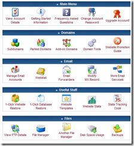
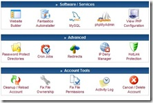

春节前闲着无聊，尝试一个美国免费空间000webhost空间。整体感觉还不错，官方称这个免费空间比收费空间还牛，试用之后觉得还不错，FTP速度没的说，在国内访问的速度也还可以。

不过申请000webhost空间稍微有些麻烦，要用代理。000webhost不允许中国的IP申请。加上美国代理之后就可以了。

\-----------

> **000webhost的空间概况：**

空间大小：[1500.0 MB](http://members.000webhost.com/panel/disk_space_usage.php?accountID=1368808&login_hash=cKo5PtTU4NQ0b5hJ)

每月流量：100000 MB (100GB)

这的确是不错的..

并且000webhost支持域名绑定

**000webhost的功能：**

 

从截图你就能看到000webhost强大的功能了吧。

还有一键安装常用网站系统的功能，的确很强大，不过最近系统升级，这个功能暂时停用。

**000webhost空间的申请：**

网上有很多000webhost的申请教程，其实真的没有那么复杂。对于新手来说看似详尽的教程会把他们搞的很晕。

**申请000webhost的关键在于IP问题**，只要IP不是中国的就行，我推荐大家一个软件：**无界浏览**（大家要注意分寸啊，爱国爱党才是正路）。 打开无界浏览之后，用IE直接上[www.000webhost.com](http://www.000webhost.com)就可以很容易的申请到000webhost的空间。

PS:登录000webhost管理的地址是：members.000webhost.com

      FTP登录的时候不需要打代理..

还有什么不明白可以留言…
