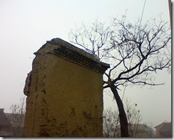

今天回爷爷家了，爷爷老了，很老了。 年轻的人都搬到新盖的房子住了，爷爷家那一排院子剩下的人家不多了。爷爷还守着他的老房子不愿离开。

虽然现在日子好了，但是爷爷仍然很节俭，我喜欢听爷爷讲历史的东西，爷爷是地主的儿子，曾当过人民教师，大跃进时期由于经济问题回家参加大生产，地主的儿子处处受欺负，爷爷顶着压力带着一家人扛过来了。

爷爷一辈子不容易，经历了很多的东西，但是他仍然是一个农民，住着自己的老房子。 爷爷家院子里的一块垫在地上的碎了的石碑见证了家族曾经的辉煌。

离开的时候村口的时候看到这个，想起那个石碑。这个土墙是过去村子抵御土匪的城墙，现在已经成这个样子了，一棵枯树守着他，就像爷爷守着老房子。
