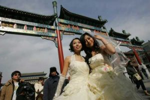

据 [网易新闻](http://news.163.com/) 报道： [同性恋情侣北京前门大街拍婚纱照(组图)](http://news.163.com/09/0216/07/528P59VT00011229.html)

　　核心提示：2009年2月14日，情人节的中午，两对盛装的同性恋情侣在前门步行街拍摄婚纱照，并和其他同性恋朋友一起向路人赠送玫瑰。参与的同性恋情侣称，希望通过公开拍摄同性结婚照的形式，推动社会对同性恋群体的关注和接纳。[查看全文>>](http://news.163.com/09/0216/07/528P59VT00011229.html)

　　

 

　　跳蚤网志如是说：

　　不管怎么说，至少这些年轻人敢于对已存的标准提出挑战。

　　记得去年10月的　《VISION》杂志上讲到有一个先锋艺术小组搞得一个展览，名字忘了，要传达的观念就是“模糊的性”，他们试图改变人们对性别的绝对认知，传达一种模糊掉男性与女性的绝对分歧的观念。 就像是非美丑，没有一个绝对，他们试图用自己的展览来改变人们的观念。

　　而这几对“同性情侣”，似乎是中国的先行者，他们的勇气令人佩服，我不想过多评论他们的行为，我只是希望社会能给这些边缘群体多一些的支持与赞同。
