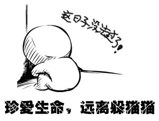

中国某公民与同监室的狱友在看守所天井里玩“躲猫猫”游戏时，遭到狱友踢打并不小心撞到墙壁而导致死亡。由此可见躲猫猫游戏之危险性！鉴于此，[ifleea](http://blog.natt.cc "跳蚤网志")在此希望广大青少年朋友珍惜生命，远离躲猫猫游戏。并告诫广大父母，请告诫自己的孩子远离躲猫猫。

　　在伟大的党的英明领导下，我国正处在一片和谐的大好形势之下，纵观国内电视、报纸、与互联网媒体，祖国形势一片大好，战争、恐怖主义、反动、色情都是国外的东西。这样美好的锦绣河山是来之不易的，所以，不能因为一个小小的“躲猫猫”游戏破坏了祖国的和谐与稳定！

在一片拥护祖国和谐的叫好声中，很多小朋友坚决表示将不再玩“多猫猫”这一低速游戏。在采访到一位小学二年级的小朋友华华（化名）的时候，他高兴的说：“一起玩躲猫猫，总觉得自己很低俗，但一直不知道原因，现在不玩躲猫猫一周了，觉得自己好像上了一个新台阶，变得高雅了，妈妈也为我的安全放心了。”

 

　　　　

　　

\[caption id="attachment\_288" align="alignleft" width="316" caption="珍爱生命，远离躲猫猫"\]\[/caption\]

 

　　

 

 

 

 

 

 

 

 

 

 

本站内容均来自互联网，仅为了练习打字使用，请在阅读后24小时内从脑中删除，谢谢。
