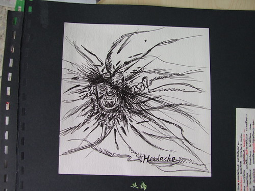

我只是略懂。请不要给我贴上标签。

　　我为什么开博客，引用一句网络名言：**因为我活着**。　　完完全全地活着，我不只是能吃能睡能呼吸，我还能思考，还能够**独立地思考**。

　　昨晚在[药店](http://www.hhist.cn)偶遇一博，人物唐小昭，我不知道他是不是博主，顺着链接去了一个博客，担心内容被法力无边的河蟹战士消灭，我将它DOWN了下来，存成了WORD文档，然后晚上开了个新学期第一次班长会，感觉主任很沉重，这个社会人人都有压力。 晚间将 小昭的经历细细品味一番。 说真话，我没有小昭的勇气，也没有小昭的思想，我只是个看客，只是看看、想想、写写、只是略懂。

　　我是伟大的祖国花园里的一朵茁壮的花朵，早上九、十点钟的太阳，一直好好学习，立志保卫祖国的好少年，第一批少先队，第一批共青团，去年又是第一批学生党员。 我是学理科上来的，政治我没有一点点兴趣，都是人和人斗。 现在大学读的是设计，南京理工大学我自认为还满意，毕竟自己掂量得来自己有几斤重，暂不说so lang tome ago 的高考，现实在这里，我不后悔。学习设计自然会接触到很多人文的东西，中西方设计史，设计理念，宗教思想，精神诉求等。 这些促使我思考。 我想不透，也只是略懂。

　　我不是异类，我没有xx的政治倾向，没有受到任何不良的蛊惑，我只是想了想，写了写。

　　我爱国，很爱国.. 我很理智，我不抵制日货，不抵制法货，不在QQ群传播流言，这是因为我想过，我思考过，我有自己判断的价值观和标准，我能够独立思考。

　　甚至，前几天我删 博文 ，我都能够理解，我理解祖国，我知道思想言论的开放是要一步一步发展的，我知道中国这几十年的发展民主程度无法和西方比，我们的国家有自己的苦衷，我们的国家还不够强大，愚昧的人口还太多，不适合完全的一人一票，我没有过激的行为，没有过激的言论，更没有任何政治主张，**我只是个学生。我只是略懂。**

　　我所说的一切都只是想探讨活着的意义，不是只为了吃喝而活，我在追求精神的价值。寻找自己精神上能够依靠的信仰，我相信这也是青年人共同的想法，懂了这些，才能活得有意义，遗憾的是，我仍然只是略懂。

　　所以，我有些迷茫。  但是，我从骨子里是个好青年，好人。 虽然我会“乱想”，但是，**请不要给我贴上标签**，人生的事情，思想的事情，我只是略懂。

\------------------------------图为我的平面构成作品《头痛》，很能表达我的情绪------------------
