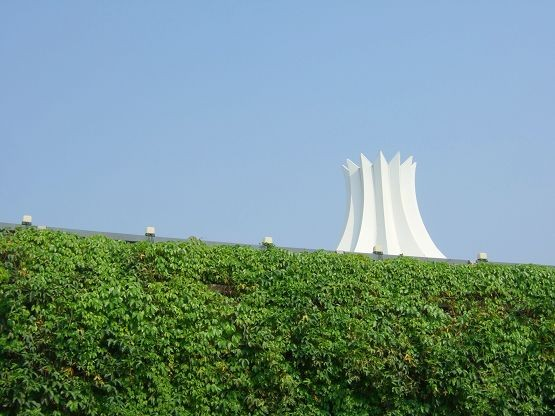

今天睡前突然想说说南宁的城市。

和南京比，南宁很干净，空气好，城市卫生也好。LP的爸爸说：南宁其实挺好，至少不用擦皮鞋。不过南宁的街头确实是有擦皮鞋的，而南京确似乎没看到，难道南京的城管比较牛？城市的天空很蓝很亮。返程的前夜我和momo坐在西大主楼的台阶上，我看着宽阔的路、昏黄的路灯，感受徐徐的清风、momo的臂弯，突然有种异样的感觉：我开始有些迷恋这座城市，不只是因为momo在这里，更因为这里有南京没有的东西，在这里可以感受到更多的生活，似乎这里才更贴近我向往的生活。

我曾经在校内状态说：“我是一个没有志向的人，我想在小城市里过平静的生活”，这引得momo深夜给我打来电话。南京给我的印象是更多人的拼搏和梦想，拥挤的人潮，我不喜欢这些。不过我不是没有志向，我希望自己不要成为各种事情的奴隶。我的思想不想被束缚，希望自己能够有自己的独立的思想，能够做一些自己喜欢的事情，能够在自己这短短的一生中做更多自己觉得有价值的东西。

在台阶上我和momo都含着泪，我们彼此都在为共同的未来努力。在世界找一个小小的角落，过自己的小日子。

有点远了，接着说南宁。从色彩来说，南宁是一座饱和度很高的城市，阳光明媚的时候城市里真的很美，很鲜活，很年轻的感觉。而南京是灰色调的，空气的污染侵蚀着这里，南宁的绿色的呼吸使我难忘。| momo说：你看这椰子树，QC是学农学的，QC说这是草本植物，就是说你面前的是一棵大草。我心里想：magic land  （ 引用hhist）

再说西安，家乡的方向……
