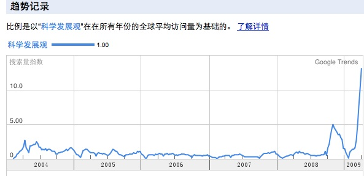

图片：Google Trends

在草泥马文化、河蟹文化蓬勃发展，中国武林绝学打酱油躲猫猫俯卧撑大行其道的现在，我们不得不承认社会主义国家的优越性。一堵**无形的大墙**把中国的网络环境搞的干干净净，就连互联网上面“**科学发展观**”的模板论文上面的某些关键词都**被屏蔽**，由此可见这堵大墙已经相当成熟了，随风潜入夜，河蟹细无声啊。

在当前中国的一片大好形式下，自费订阅党报党刊的群众几乎没有，那么怎么发展我们的社会主义呢？党员！目前全国都开展了“深入学习领会科学发展观”的热潮，中国特有的条幅文化得到了充分的发挥，无论党政机关、学校学院还是街道社区，纷纷挂上了学习科学发展观的大横幅。值得一提的是：中国高校纷纷展开**科学技术为政治让路**的活动。就x京x工大学来说，每周三下午所有老师、学生的所有课时都被调整，**专门腾出一个下午**的时间供大家”深入学习科学发展观“。领导通过各种方式阅读“**一个xx、两个xx、三个xx……**”而参加学习的师生们也都精神高涨，打瞌睡的人数已经**低于90%**！多么可喜啊！

稍有头脑的同学们都能够发现科学发展观的**神通广大**，它适用于各个领域的各个具体事务，可谓居家旅行常备理论。党员同志在党组织的“建议”下纷纷通过网络学习科学发展观，并熟练的Ctrl+c ＝>>Ctrl+v完成自己的学习心得，学习体会，学习论文，学习报告等等……google中”科学发展观“的搜索了明显飙升！

我很骄傲的说：明天下午3:00～5:00，我将参加x京x理工大学某学院党支部的“关于科学发展观的讨论会”。

我从来不说脏话，我草泥马戈壁。
