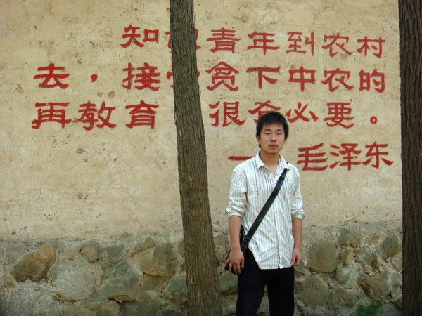

今天班上去春游，南京将军山。

很累很开心。大家气氛很好。

这个“知青故居”是我最喜欢的风格。爷爷过去没有多说毛主席的历史，只说了说过去的生活，在政治高压下受到的欺辱。爸爸倒是对着我的碟包上面的毛主席说，这个包不好。后来我明白了爸爸说的含义。我们这一代人和毛主席已经远离，但是毛主席的影响没有消失。对于这种红色经典的文化，我觉得我没有体会吸收的意愿，而更多的是一种类似波普艺术的调侃和一笑，毕竟毛主席是过去的神，而我们不信奉神。

看到这个小院子，我想起了爷爷，在我懂事之后我才明白爷爷除了知识以外的智慧。他懂得将自己的锋芒隐藏起来，将自己的想法隐藏起来，自己是一个有思想有勇气的人，但是甘于做一个农民。爷爷没有出过远门，但是我能够看到爷爷深邃的眼光。我喜欢爷爷温和的性格和处事的态度，我永远的典范。爸爸教会我感情和事业的平衡。我感激生命中遇到这些“哲人”，也感激遇到momo. 我们都已经长大，我们都是有故事的人。

最后祝爷爷健康。
