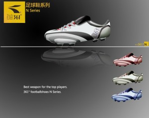
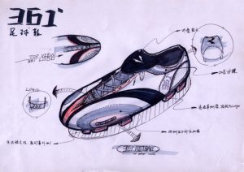
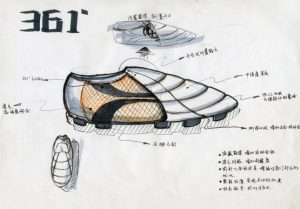
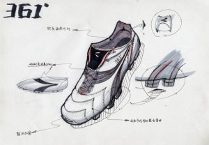

这周专业课的作业多到让人恶心。上图是自己设计所谓“名片”。曾老师说“这怎么说明你是设计师呢？”我不想泄漏自己这个小角落，就没有说这是我博客的地址。毕竟言论自由不想要自己的长辈干预。

另外一个设计作业，设计“361度”的鞋子。我们前期已经做了充分的调研工作。这次要做的是三张手绘和一张PS稿。下面发图上来吧，打字累。

就这样吧。就算我是个设计师吧。

周末还要平面作业要做。到时候再写写吧。
