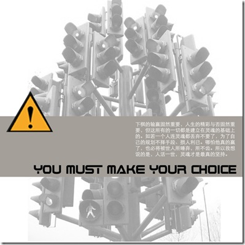

这几天南京很热很热。作业也攒到一起了，天天晚上对着电脑做图。

昨晚做图恶心了，出去吃夜宵，回来就发现Google的精华全部被墙，真的费解。Google就这么一点一点被阉割。做完乘着怒气就在校内发文一篇，发泄一番。可是我们这样的P民能做什么呢？ 我们从出生就认可自己的草民位置，我们不企图反抗，不企图追求多么好的社会。 看过吾爾开希的博客，里面有他对父母的话，他希望的社会是一个没有恐惧的社会。我没有那么高的境界，我只希望能活在没有压迫的社会。

买的人物周刊5周年，里面对艾未未的定语是：  中国前卫艺术代表人物，从事艺术，设计，策展工作。这和饭否上面的艾未未完全是两人。为什么艺术工作者的新浪博客会被强制关闭。

昨晚Google事件之后，ｋｅｓｏ在博客发贴《[更黑暗的一天](http://blog.donews.com/keso/archive/2009/06/24/1532795.aspx)》，内容简洁明了四个字：悲愤。仇恨。  字号很大。

中午吃饱喝足发发牢骚，下午接着做图。明天还有模型和泥模。加油加油～
