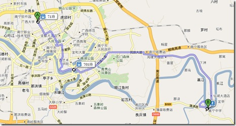
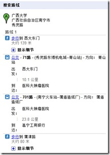

今天MOMO没课，我们一大早起来出去玩。我们都是有计划有安排的人，今天的行程昨天就安排好。去“五圣宫”古建筑群。听起来多吓人啊，古建筑群，注意这个“群”字！

GoogleMaps给我们提供的公交路线：

按照Google的路线，我们早上从学校出发，在西大门口买了阳光早餐：一人一个酸菜包子，一共一杯绿豆海带粥。由于担心在中途换乘没座位，我们打算直接到火车站找701路公交车。在某路公交车上，我们在火辣辣的太阳下边流汗边吃包子。=.=|

到了火车站已经是差不多快10点，在几个站牌怎么都找不到701的出发站。我们很晕，于是我拿出手机打开GoogleMap手机版打算看看。我搜索701的路线，又对比这火车站那里站牌的车次看车站，终于看到213和701有交汇点，在所谓“民族会展路口”。至此，我们终于顺利的从学校经过2次辗转，出城进村再进小县城，到了那可爱的邕宁，去看那可爱的五圣宫。

话说我们中午在Google告诉我们的邕宁工商银行站下车的时候，已然中午12点有余。下车后找个看着还不错的馆子解决温饱问题。小县城的馆子不说什么了，点的酸笋炒猪肝，上来差不多都成了酸笋炒肥肠了，虽然我很喜欢肥肠，但这非常的确很令人失望。出门在外，不说什么了。

不过南宁的茶永远不会令我们失望，大热天吃完饭买了一杯加糖的茉莉，拉着MOMO看着GoogleMap向五圣宫出发。

“你说五圣宫门票要多少钱啊？”

“怎么也不会超过20吧，总统府学生票才20，几个小神仙怎么都不会比它贵。”

到了才发现，门票1元/人次。烧香有2元一炷的，有3元一炷的，最贵的是5元。我还以为这牛B的“古建筑群”有多么多么宏伟，甚至去之前我都想到了去年夏天和MOMO同去的龙门洞。进去买了两把香，一共十几炷。正殿是某神仙我忘了名字了，边上两个小殿也各住着两个神仙。

在院子里能看到后面有山，山中有亭，遂以为从某初极狭，才通人，复行XX步才能有点光的神奇洞口能进入另一方天地，令我心驰神往。可仔细一看才发现这五圣宫的“古建筑群”给我的惊喜不只这几个神仙，整个“古建筑群”只有4个门，包括进入“建筑群”的大门和三个殿的门，别无他门。

也难怪，古人以“三为多”。“三人行，必有我师焉”就用这个“三”，此“古建筑群”三个殿加一个门楼较“三”仍余“一”，称之为“群”也真巧妙。

我们在五圣宫总共进门出门也就5分钟。我对道教那些泥巴神仙没兴趣，随便烧几炷香也罢。后来发现后面的亭是“某公园”，名字我又忘了。门票1元/人次。进去在亭内就坐休息一番之后，又买一杯绿茶打道回府。

\---

总结，今日游览历时6小时，其中车上4小时，吃饭近1小时，寻路半小时，剩下不足半小时为游历时间。我们带的DV根本没有拿出包包，相机照了一张照片，亭子旁石头上的一只癞蛤蟆。

望 南宁欲往五圣宫“古建筑群”人士三四而后行啊。
