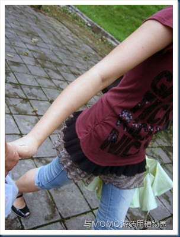

昨天MOMO没有课，我和她中午吃完饭，直接坐66路去所谓“广西药用植物园”玩儿。话说那66路坐的真让人痛苦啊。

到达那园子已经是中午2点多了。我们下车的地方是北门，上面油漆刷着，请走西门。我汗。 打开GoogleMap看了下，还要走一段儿，当时好累，就和MOMO坐在草地上休息了一会儿。起来后，很快到了西门。又见江泽民同志的题字：几个大大的“广西药用植物园”的大字立在某建筑上方，我想起了我们学校和家乡的宝鸡宾馆，都是江老先生的手笔啊。

\--唉，来买门票啊你们俩。

\--多少钱？

\--一人15.

\--15块？（我在想，就这么个菜园子也要15）

\--拿学生证8块。（那人看我们犹豫，降价了）

\--好吧，那我们买。（我拿出20给她。）

\--算了，你们俩算15块吧。（那卖票的还嫌找零钱麻烦。=.=|)

图为入园之后和MOMO手拉手的照片。

不过说来，在南宁这个园子还是不错的，有种进了热带森林的感觉。蚊子一直绕着我们飞，只要敢停下来，必有蚊子咬人。不过想来这小园子也没多少人去，这么多的蚊子怕是快要饿死了。出去一下午，清凉油用了大半盒...

晚上回来我们去爱民螺蛳粉吃粉。好爽好爽，爱民那么多人，我们坐在小角落里，吃得那个开心啊。///广西这边做肥肉的时候喜欢油炸，MOMO给我买的那可爱的猪脚，也是炸的，乍一吃还不错，不过多吃几口就觉得有点腻了。

昨天玩累了，今天早上我都没醒来送MOMO,我醒来的时候已经10点多了，MOMO已经走了。给她发短信她说我早上很可爱的赖床不起，我竟然都毫无印象。一会儿和MOMO吃饭的时候再听她道来。

今天27号了，过几天MOMO补课结束之后我们去某古城玩儿，名字我又忘了...  再去桂林玩儿---这奢侈腐败的出行啊。6号中午我们从桂林机场之间回家，结束这疯狂的一个月。

闲扯到这儿吧，洗洗涮涮出门接MOMO然后去吃饭了。
