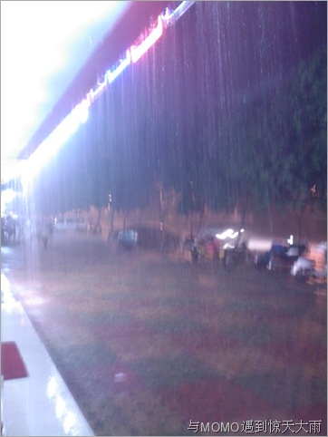

昨晚和MOMO在火炬路吃饭，饭后见此大雨。虽然我们有伞。但这么大的雨仍然限制了我们的勇气。幸运的是我们都穿着人字拖，在水中前进比较方便。但溅起的水花和鞋子带起的雨水会打湿裤子乃至T恤后背处。

这个照片拍的时候我们已经能够抬头看到住的高层了。稍作休整，我们打算出发。我勇敢地变身热裤男，我穿的大短裤被我卷了起来，一直到大腿根部，好一个变身热裤男！

我一手抱着MOMO，一手握住伞，两人在伞下面步履维艰地走出屋檐。每遇路口必然遭侧向涌来之洪峰，直冲两人脚踝，溅起水花在往来汽车车灯的照耀下光彩夺目。 =.=|

几分钟后，和MOMO回到了家，身上基本湿透。热裤男也脱下了热裤，换了全身衣服。
