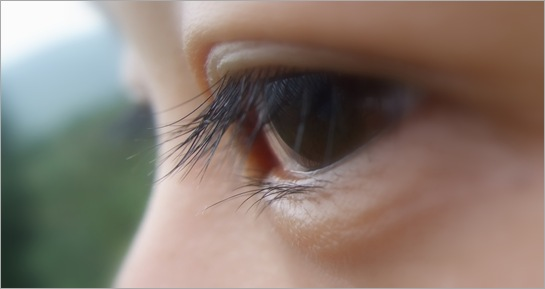

 

 

这几天飘荡在桂林。明天回家。

第一天和MOMO跟团去漓江，去世外桃源，去溶洞。同行者中有一对东北夫妇，年龄四十有余，体态丰腴，颇有暴发大户之感。男人的纯棉汗衫早早被汗水浸湿，而女人在漓江游船上的时候已经没有力气出去观光，只是到了二十元人民币取景点的时候才出去和男人合影，然后再进来。维持她旅行兴趣的就是吃。

昨天去龙胜梯田和瑶寨玩儿，观看梯田的观景台很高，我和MOMO走上去都是一身的汗，看到所谓“七星伴月”的梯田“美景”也的确令人失望，唯一庆幸的是我们上来了，走上来了。久久不舍得再下去不是因为山路，而是因为到顶是我们付出汗水唯一的收获，而风景，完全不能称之为风景。

上山的途中有很多农夫，他们出卖着自己的体力来换取养家的钱财。两人抬一部轿子，下山的价格是100RMB,而上山则更贵。不要觉得贵而唾弃他们，因为这大都是为肥胖的外国友人准备的东西，对外国人来说，他们的钱和我们的不是一个概念的。那些老外的工作环境下，同样的工作量他们能拿到的收入远比在中国付出同样的劳动拿到的多。两种社会中劳动的价值是不同的。相反，我们应该同情这些出售体力的农夫，付出 如此大的艰辛，为的只是一家人的生活。试想让这些农夫在巴黎帮人负重会拿到何种回报呢？

当男人都渐渐开始挺起大肚腩，女人开始身材走形的时候，目光远远没有孩子那么清澈。他们的眼里多了许多人情世故。

同行者中同样有很多人让人觉得不爽。大人素质低下的结果就是带着的孩子也是如此。同行三个大人带着的四个孩子，甚至不知道基本的尊重和公共道德。 孩子是无辜且可怜的。

看了这么多，我们庆幸，我们的目光依然清澈。
