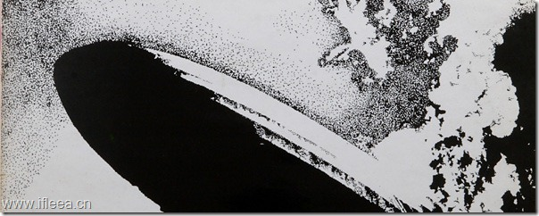

昨天无意中又听到led zeppelin 的 stairway to heaven.8分钟长的歌一口气播放三遍，那种感觉好像心里有话要说，却在后面强劲的吉他solo中被封住了口，跟着飘忽不 定的吉他飘了起来，直至灵魂出鞘，最后那低沉充满脆弱感的"stairway to heaven”又把思绪拉回来，忽然清醒原来自己在听着这首歌，这首歌马上结束。

曾经在听G N R的时候常有这种感觉，November Rain 的时候SLASH强劲的吉他SOLO将思绪带走，直至音乐结束，才顿然醒悟。

谁都说不清Stairway to heaven 歌词里面说的是什么，强行理解字面意思只是觉得那是一首无聊至极的打油诗，但是几乎可以肯定的是，这是典型的drug song,歌词都是在LZ嗑药之后的幻觉中写下，可谁又能否认这音乐不会给人带来一些连自己也说不清的感触呢？

浅吟低唱到急速爆发再到飞流直下以为上了天堂却直入地狱，这种感觉除了在毒品的幻境中能够更感官的表达出来之外，似乎没有更好的出口。

经典的音乐像毒品，能不通过直接的感官体验就将你的灵魂抽离肉体，经历天堂地狱般的幻觉之后回到现实，stairway to heaven 开始时的低唱似乎如催眠术般让人的灵魂魂牵梦绕般盘旋上升，6分钟处的SOLO似乎是在上升最高点时的赤裸裸的鞭打，紧接着jimmy锋利的嗓音在脚下的路上划开一道裂口，直通地狱。

如海洛因，令人灵魂出鞘。
