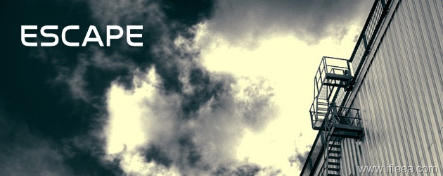

BTCHINA关掉了，VeryCD莫名其妙关键节骨眼宕机，全国IDC机房关停上千个，我的wordpress群里面的朋友们失去自己的博客。涉H，涉 贝者，涉毒，甚至反 云力的网站是主要的打击对象，但是我们这些可怜的博主呢？虽然博主们有充分的道理，充分的理由，但是这都是没用的。在“宁可错杀三千，也不放过一个”的指导思想下，现在的互联网中国局域网已经变得空前和 讠皆。

可是谁为可怜的博主买单？这种可怜的情况只能自己兜着。国内的IDC们纷纷挑起自己紧张的神经，无时无刻不巡查自己的机房硬盘里有没有躺在博主敏感的文字。若有，马上要求删帖。如若不从，封杀博客。

可是这也是IDC们的不幸，谁又来为可怜的IDC买单呢？机房的硬盘中若有稍微哪怕一点点哪怕芝麻似的不和X，主管部门马上要求IDC删除，如若不从，关闭机房。永世不得超度。

在这个形式下，博客正常的生命财产安全以及不能得到保障，那么自然会想到escape，到一个安全的地方。哪怕你的博客只是说说吃饭穿衣的琐事。

为了我的博客能够正常的反应我的思考而不被河蟹吃掉，为了我和我那可怜的IDC不至于天天绷紧自己那可怜的神经，我依然决然在大洋彼岸的USA建立个人BLOG的镜像站点，域名也启动了国际化的 COM域名。目前数据转移工作已经结束，调试已经结束，个人BLOG已经有CN版和COM版的区别了，不过内容是同步更新。同时，订阅的RSS我是通过feedsky烧制的，本次博客Escape行动对于订阅的朋友没有任何影响，主RSS源还是CN域名的，不过不排除CN这个光荣倒下之后我转向到COM的RSS，不过这些订阅的朋友都是不用关心的，我会对自己的RSS负责，对订阅的朋友们负责。

生活在国内博心惶惶的网络环境当中，我的博客情绪仍然稳定。

另外感谢[衡天小张](http://hengtian.org/)的USA空间赞助

USA网址:http://www.ifleea.com
