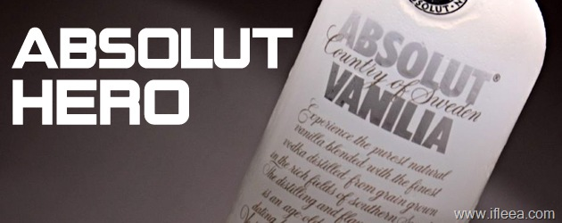

加粗的字体表现出我对烈士无比草泥马的崇敬。

YES !  ABSOLUT HERO.

轩尼诗XO放翻了我们亲爱的交警队长，但是他那不畏烈酒的精神值得学习，哪怕是上千块的轩尼诗 !

酒精考验的酒坛名将、杰出的酒类鉴别专家、千杯不倒的陈录生先生，在公元2009年12月12日的喝酒中，因饮酒过度，不慎以身殉酒。  
陈录生先生的一生，是饮酒的一生，是同各种烈酒战斗的一生，他一生爱酒胜过爱自己的生命。无论是条件艰苦，生存困难，他嗜酒如一，坚持同酒较量，从不退缩。  
陈录生先生具有高度的喝酒自觉性，从不需要家人、同事和亲友的督促，积极主动请酒，总是竭尽全力开怀畅饮。即使在喝醉的情况下，也决不认醉， 直到不醒人事，无愧于酒坛宿将。  
在生命的最后关头，他深情地对谢飞勇说：“我一生追求酒的浓烈，没有时间，没有钱，也没有精力，照顾自己的亲人，酒精伴我寒来暑往，我死后请把我的骨灰撒进酒缸里。”酒鬼陈录生先生永远地告别了酒桌，我们再也听不到他烂醉如泥时的豪言壮语。他一生清贫，把所有的精力和积蓄都贡献给饮酒事业，他的伟大的精神将永存酒友心中 ！他酒后勇于打架、敢于跳楼的壮举将永示后人！  
陈录生先生永醉不醒！

\===背景阅读===

### [深圳一交警队长赴宴醉死 警队拟为其申报烈士](http://news.163.com/09/1214/09/5QG119CK000120GU.html)

\===========
