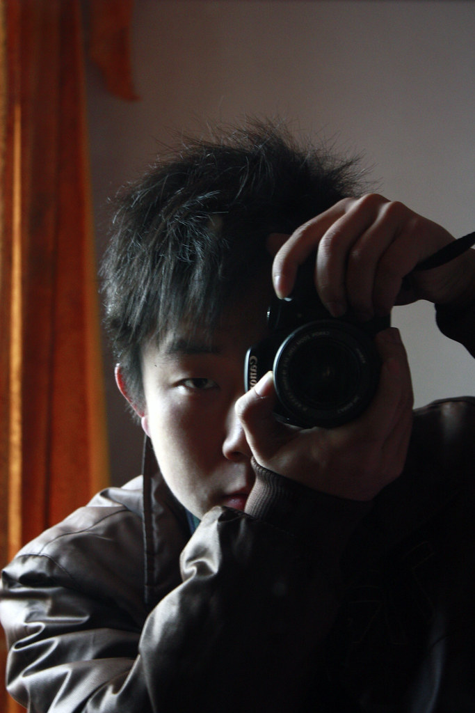

貌似搞摄影的都有这么一张 ...  我也装个13来这么一张图。

大清早起来的时候匆匆忙忙中拍下这么一张，敬请看官忽视这不洁的镜面、手动对焦、低光线下高ISO产生的噪点。忽视我这越来越柔软舒展的脸庞。忽视我与这个相机的大小对比产生的铁汉柔情之感。

说正事儿，一大早就跟着爹娘回到了爷爷家。每年元月农历初九，爷爷家那里都有庙会。今年更是盛大，村里出钱请来了剧团搭戏台为大家唱戏助兴。我虽然听不懂看不透秦腔这一门深奥的艺术，但是仍然记得在很多年前仍然是爷爷家的初九庙会，在庙堂边上的空地，搭起高高的戏台，台上的演员门带我给的冲击是真真实实的震撼。而今天，我也是慕名而去再次回味这种震撼。

明天和妈妈去西安找MOMO然后一起去留学的中介咨询咨询，看看我和MOMO如果要出国的话有没有什么出路。也许是贴金，但是我更直接的想法是想跳出自己的生活看看另外一种生活方式，然后反过来思考自己的生活，就会有很多想法。或许，这有利于做设计，或许，这什么都不是。

明天最吸引自己的，就是那一份不可知。所以真的希望能够走得更远，看的更远。也希望和MOMO同学好好的开开心心的。

不管走得再远，追求再多，也终究会带着MOMO回家看秦腔。

PS,附图一张，秦腔现场高清无码。

