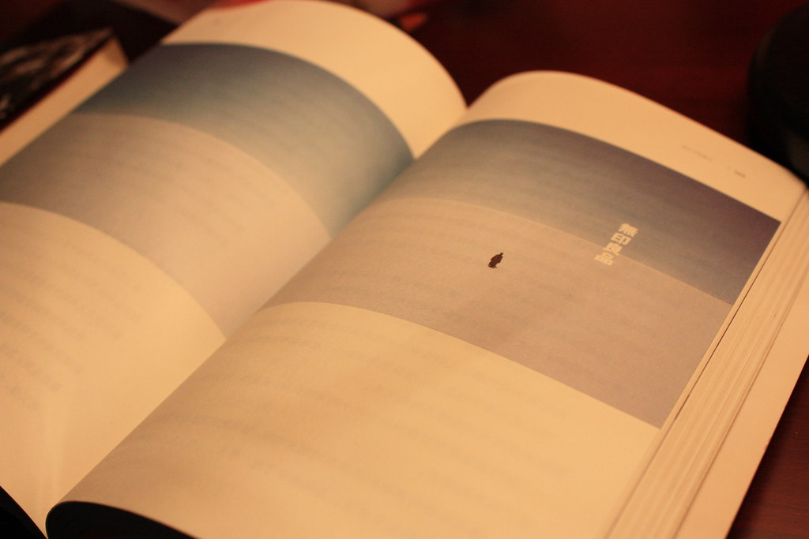

不得不说今天的西安之行还是很成功的。而且MOMO同学一路的陪同与支持也使得行程很愉快。在回来的大巴上，昏昏沉沉的我收的MOMO的短信之后，突然激动的似乎要从周围都昏昏沉沉的人群中跳起，开心。

我晚上一直在等着MOMO给我的结果。虽然一直告诉自己不要奢求完美，不要企图一帆风顺，但是毕竟还是希望能够让MOMO得到家里人的支持。结果来了，还好，在心理预期之内，几条短信送MOMO睡觉之后我开始慢慢陷入思考。

早上和妈妈在动车上的时候说到了那放羊的羊倌。其实这种简单惬意的生活是我们每个人都向往却绝对不敢于追求的。我们看得越多，我们就像看得更多，我们就永远停不下更多的追求。

《设计中的设计》一书里面说到的日本无印良品的宣传广告，就是照片里我翻拍的图，大盐田的无以更简的地平线，给我们无尽的遐想。忘不了书里所说的“容器”这个概念。

乱七八糟的，不管走哪条路，我肩上的压力都很大。真的什么时候我能独自一人暂时放下肩上的责任。我想我肯定会放声大哭，放声大喊，用力奔跑。

但前提，一定是我们扛着走过去。
