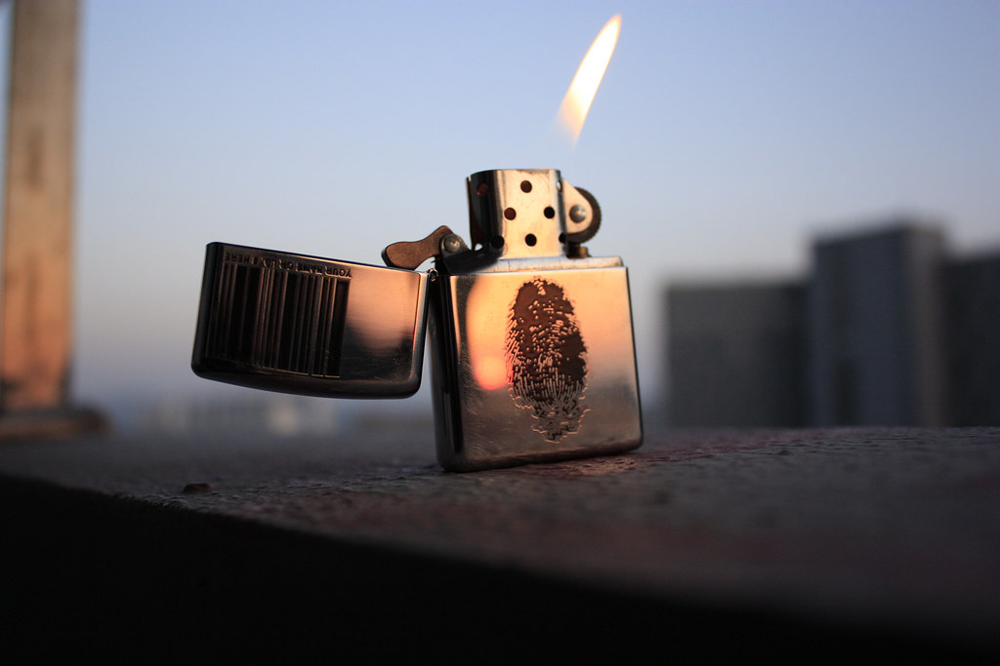

那天夕阳的时候拍了个打火机，虽然只有小小的火苗，但内心里却藏着太阳的能量。

自从撂下所谓南下创传说的日志之后已经差不多半个月没有更新这里了。不是不想，学校的生活单调而无聊。我刚到南京的几天MOMO同学也终于定了自己今后的路，自此，我们都向着各种的方向努力着。但这也注定我们以后还是不会在一起，看来我原来的想法还是太简单。

开学三周，雅思的课程已经早早报名了，明天就是上课的日子，从今往后，我的周末将全部献给雅思，足足三个月。也不知道这三个月时间能把一个平庸青年变成何种模样。曾经简单的以为大一过后此生与高数say goodbye了，但最终还是要还的，大学的成绩不够理想，没办法昨天选择了高数重修，希望能提一提大学的成绩，毕竟11个学分的高数绩点都是1，对自己的影响实在太大。

球队也开始训练了，虽然为的只是个学生自发组织的足球联赛，没办法，遇到SB的某院领导以足球伤害性太强为名叫停了南理工传承多年的足球联赛。反而大力发展女足，理工类的学校没有一个像样的足球篮球联赛，有的只是女足。听着都觉得可笑，可笑的都想啐他娘的一口。

摄影课的王老师还是很有意思的，搞艺术的果然思想活跃言语丰富。“背景像奶油一般化开，哇～太迷人了～”王老师说这话的表情和这句话一样迷人。下午的摄影课我们去所谓“摄影棚”玩光涂鸦，这个还算最近的一枚亮点。

明天开始，南京街头又会多一个背着书包好好学习的青年形象。
