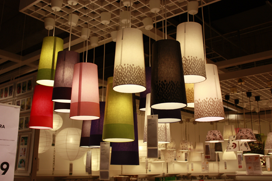

昨天下午昏昏沉沉上完雅思课，自己坐在52路公交车上的最后一排最角落的座位，无力地靠在车厢。在这般无力持续了十几分钟的时候，突然发现原来自己忘了插MP3。“没有什么能够阻挡..”我自己差点眼泪奔出来。这么多年的歌已然能给我感动。

插着许巍的歌辗转到宜家。周围都是年轻小两口而我一个男生背着背包看起来不免有些不入流。而且一个人穿梭在为了自己的新家而满眼幸福的人群当中的确有些让人思念远方的MOMO，不是有些，是很。 完成任务之后又看到了MOMO肯定会喜欢的灯，所以又掏出相机帮MOMO留下的几张留作纪念。毕竟生活就像这灯一样五颜六色而充满光明。

晚上去奥体看了江苏VS上海的小德比，很爽很减压。
