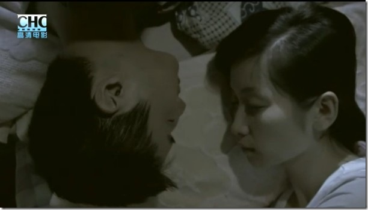

无意中看了《怒放》，也叫《姐姐》。

截图中的画面深深打动我，那是我和MOMO也曾凝视的角度，我也曾如此擦去她眼角的泪花。

虽然片子说的那些事儿发生的年代我是不曾经历的，但是心中还是不免有些共鸣。

除了白文，别人都知道姐姐为什么不能嫁给他，但却都没有告诉他。他们本可以有一个大房子，五角星的顶，看见星星月亮。可年轻的代价就是两手空空空有对未来的执着。白文是好男人，姐姐是好女人。好男人要给好女人幸福，好女人知道幸福在那里而自己却失去资格。好女人选择离开了，好男人不能接受现实，活在自己的幻想当中了。

当他终于看明白事情之后，他失去了心爱的女人，失去了至亲的兄弟。剩下了和姐姐那些美好的回忆，记得十八岁时的初恋。
