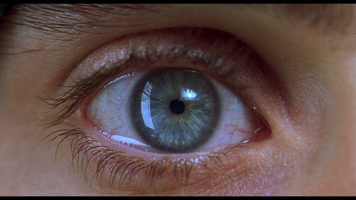

考完雅思第二天终于忙里偷闲看了一部好电影。豆瓣上看到YUN同学的“看过”，YUN同学的品位是不同质疑的。于是毅然决然找到比较高清的版本，下午一人坐在宿舍看完这部电影。 不得不说这种看完不知道它确切要表达的东西却又使人不禁思考下去，这样的电影才是好东西。

引用豆瓣某君的简评：

“人的不安定和痛苦往往来自于精神与肉体的矛盾。人们往往不是忘记了精神的存在，而追求肉体的满足，就是忽略了肉体的存在，而追求精神的满足。这两种矛盾状态都会带来痛苦，使人被自己践踏、异化，或者应允他人对自己的控制，其结果都是精神被支配，肉体被奴役。或者更直接的，他们直接被自己的梦想所控制和奴役，而梦想是被社会操纵的，于是他们就逃不过失去自由和自我的下场。”

突然想到两年前看到的电影《暴雨将至》，后来再怎么找都找不到下载。 和Requiem for a Dream类似，他也用很底白字化为几个章节，看完只觉很有冲击，但不知道是哪里受到它的影响。

生命是复杂的，能说出一些生命内在东西的，也必然是超越任何形式的，形式只能成为内涵的羁绊，但必须有一个形式来承载内涵。那么就不难理解为什么我看了，我动容了，但我却说不出。
