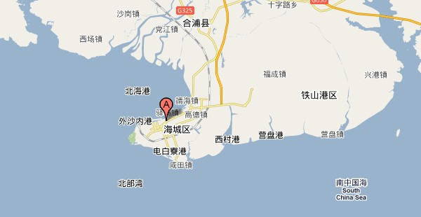

前几天和MOMO从南宁出发迎着台风去北海搏击风浪。结果天气预报两天暴雨让我们在北海深深地晒伤了。

而且，风平浪静的银滩海面因为台风的影响而波涛汹涌，成为那两天北海游的最大乐点。

人也回来了，晒伤也在慢慢恢复，就暂且说说我们的北海游记吧。

1\. 打死也别信在线订酒店

我和MOMO担心去北海之后住房紧张，提前一天在艺龙（elong.com）上订了间海边宾馆的标准间。还用了我的信用卡做了担保才订到的。结果第二天我们到了之后才发现住在海边的各种不方便。虽然出宾馆就是海滩，而且还是不错的能下水的沙滩，但是交通实在是不便，而且宾馆的设施的确有些令人失望。  何况，北海的核心干道四川路上，酒店很多很多。北海很小，从四川路几乎能不倒公交车直达你想去的任何景点。

2\. 要多多利用小三轮

北海这个旅游城市充斥着大量的人力三轮（其实已经全部更新为电动，但是人们还是这样叫），这些三轮拉客时副业，主业是将客人送到珍珠店，送到海鲜店，代售景点门票之类的，所以车费及其便宜。基本上市区内3块钱搞定。而且不知何种原因，他们都能搞到海底世界的打折门票。我和MOMO打算去海底世界看鱼，门票价格是118RMB/人，但是都知道三轮车能有特殊手段，经过几番讨价还价，我们顶在40RMB/人成交。 人人都是三轮拉过去的，没有直接买票的，这个的确很是奇异。

3\. 别相信天气预报的鬼话

天气预报告诉我们，我和MOMO去的那两天北海暴风雨，我们还打算享受北海的另一番风味呢。结果把我们晒了个半死回来了。我是男人皮厚不怕啥，回来也就红一天疼一天，而MOMO细皮嫩肉的，回来皮肤红了好几天，我天天给她拍爽肤水。 我们本来打算当雨伞的，结果到北海成阳伞了。

基本也就这些东西。总的来说北海是一座很不错的小城市。
