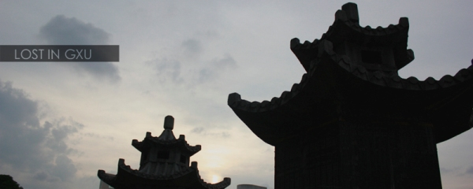

记得上次写南宁印象还是1年多之前，当时仅凭4天的经历就写了3篇南宁印象。时至今日，当我再次在南宁客居数日之后，又抄起键盘敲起了新的南宁印象。 今天说南宁的雨。

虽然我现在身在南宁，但每天依然收到两条江苏的手机报，我依旧知道江苏发生的事情。昨天早上看到淮河以南出梅了，才有想起南京那温柔委婉的丝丝细雨。在我来南宁数二十日之后，南宁也终于在昨天来了真正的雨。 我和MOMO当时正在狗洞开心的吃着红豆龟苓膏，突闻上方雨篷毕毕剥剥地大珠小珠落玉盘，我心里一喜——这便是南宁的雨了。

迅速，猛烈，奔放，毫不拖泥带水。酣畅淋漓的雨冲刷整个城市。如果西安的感觉犹如许巍  “多少次的雨水从来没有，冲掉你那沉重的忧伤”，那南宁似乎从来都是清澈的，蓝天白云微风，还有这奔放的雨。
