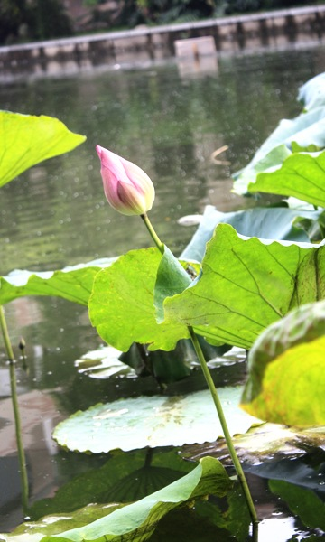
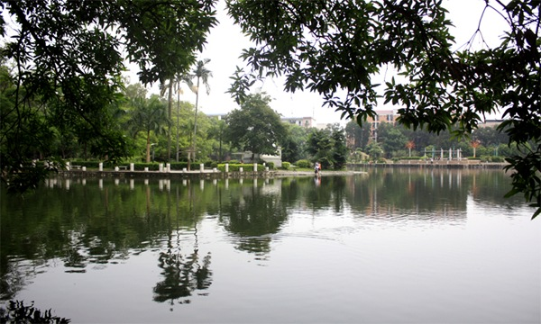
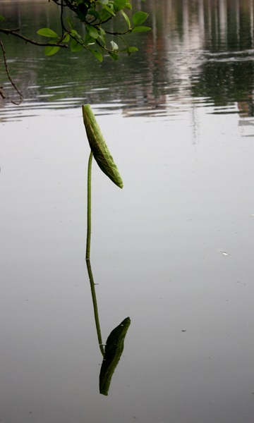
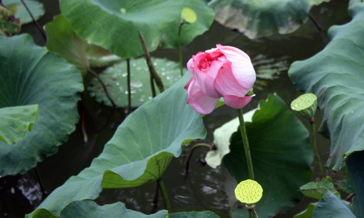

大雨冲断了铁路，于是我又留在了广西，背起相机在塘子边上走了走...

啥也不多说了，上图吧

1.虽然那天太阳不强烈，也是刚下过雨，但在校园走那么大一圈已然是会累死人的

2.所谓的纪念碑所在地。 MOMO说如果这片塘子都填上，要盖多少宿舍楼，哪儿还需要住在八人间

3.这哥寂寞地站在水中

4.每当看到完整的漂浮的荷叶，我就会想起西大东门的荷叶饭

5.周围都成了莲蓬了，它却依旧是莲花，这就是晚熟的美

6.其实，满荷塘荷花不少，但荷叶更多

本博客不伺候IE6及IE6-的IE垃圾版本，如果您看到图片扭曲，请更新您那垃圾浏览器

推荐：Chrome  Firefox
