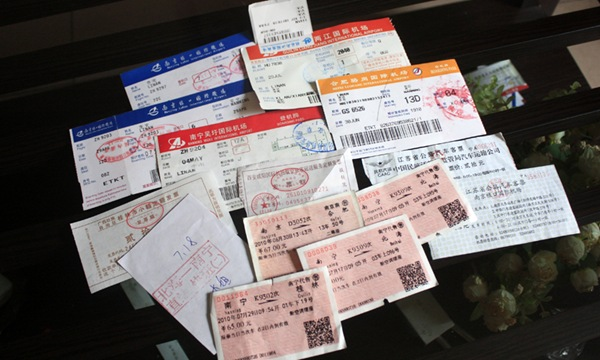

6月29号坐上去广西的飞机，7月29号辗转坐上回家的飞机。

整整一个月在南宁闹腾着，手机几乎不与外界联系，隔三差五用MOMO的电话跟妈妈电话聊聊天。 快也好，慢也好，一个月匆匆过去。

回到家第二天就出门与自己小世界的兄弟姐妹见了一小面，晚上聚点喝九度的时候开始想起和九度最好的搭配不是烧烤，而是高亚龙。跟高喝九度是爽快的，夏天我们坐在据点的室外小摊上，一瓶一瓶的九度，一趟一趟的厕所，一次一次被叫“来，进来玩”，最后晕乎乎一身酒气回到我家。

回来这几天除了第一天出门见客，其余时间都活着自己的世界。和MOMO短信短信，打打电话。妈妈昨天晚上还教育我说要多给她打电话，不能老让她打过来。我谨记在心。

从在广西那一个月天天热热闹闹，到现在在家里天天沉静无比，是一个巨大的反差。掏出包里收着的这学期旅行的票根，拍照，然后收好，再次汇入我那个小小的信封，里面收集着所有爱的票根。
