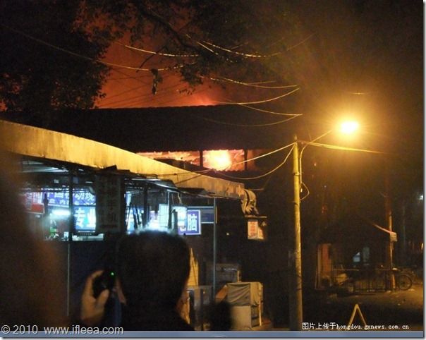

大清早昏昏沉沉倒车又倒车，喜哥的实力已经初步具备跳槽涨工资并且开始考虑谈谈女朋友结婚买房买车生子过日子的程度了。所以他依然决然抓起大半夜做好大清早打印的所谓极具设计感的简历今天清晨穿着风骚的T恤冲向人才市场——我，作陪。

在人才市场三楼喜哥和一家外贸礼品公司谈而又谈昏天黑地滔滔不绝大约有三炷香的光景中似乎看到了未来想吃就吃想喝就喝想看电影不买黄牛想买车子不用贷款的美好生活——美好的人才市场。

谈毕，地铁辗转奥体方向奔赴所谓牛逼哄哄的可以在C区白吃白喝吹空调的台湾名品展。我们借喜哥公司的名义成了所谓“采购商”。结果今天不知哪儿来了那么那么多的游客，免费品尝区被平均年龄45+性别分布80%为女性的人群围的水泄不通，在那里能看到试吃的小餐具吃饱中年人的壮举。——拍照，留念，闪人。
