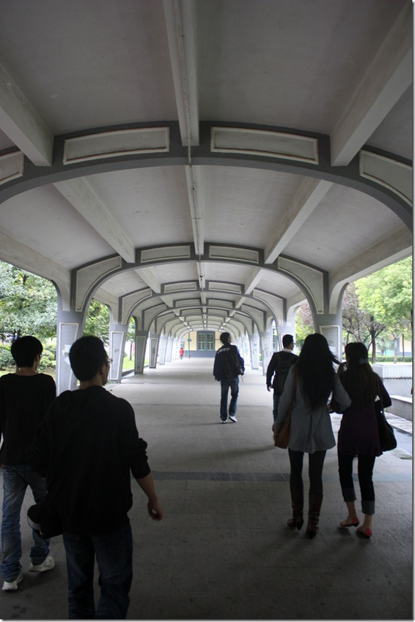

昨天早上在期待中9点睁眼看了看窗外，大雨，骂娘一声之后在遗憾中继续倒下。10点自然醒之后，打开豆瓣才发现大家那么多人都愿意雨中继续。哥是一个比较二呼呼的人，就背起背包出发。

我到的时候莫愁新寓的我爱我家门口远远就看到黑压压一片都是人，嗯，那就是组织了。 40人，壮观之至。

这位可爱而无畏的小朋友斜四十五度眺望江面，眼神中透漏出一种坚定。虽然他不是组织的人。

轮渡在江面划过一道大大的美丽的S,将我送到“码”面前。今天这里高清有码。

已经废弃的南京北站，“旧时首都的繁华啊”。

 

暴走的精华，沿着铁道不知几公里绕进了北站的站台。  触摸没落的繁华啊。

出了车站沿不知道什么路的地方狂走不知多少公里，走到某无名小馆，也终于见到了 吃豆豆，古林小分队，一一等兄弟姐妹的真身。证明出一个事实，无论在豆瓣上面多么闷骚，终究还是逃不出一个肉身的束缚。

更悲剧的事情是回来的时候要两次倒公交再换乘地铁，在南艺附近换乘21路之后，心里还在嘀咕怎么汉中门还没到，结果听报站我坐过了6站路...  下车后发现全路封闭，高架+隧道....   在MOMO同学热情洋溢的电话陪伴下又暴走1小时走入地铁站..

到宿舍，晚上11点....

精彩。
