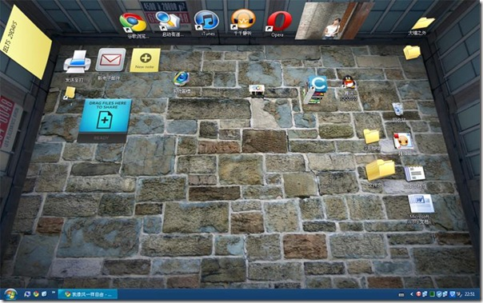

都要从这个视频说起，眼看学习工业设计的本科也快要结束，作为设计师（所谓）一定的折腾能力还是要有的。自己的BenQ也被我当小白鼠上过XP,Win7，MAC OX1.5.6 , UBUNTU。 不得不承认MAC 的界面和 ubuntu的界面的确很炫很牛X。 而WIN7 似乎也学到的一些，固定的任务栏类似dock的设计，半透明与渐变的视觉效果。

本着折腾的精神，也为了弥补我最爱的XP的丑陋，桌面美化软件也装过不少。不过仅限于视觉效果上。

昨天在校内看到有人分的这个视频，俩字，震撼。于是今天自己也装了个感受了下。买不起PRO版本，就用了FREE版本。 不过整体效果还是出乎意料的好。 就看这个视频就能知道其强大了。我的小白鼠装上后效果如下图：

不过遗憾的是图片浏览功能一键Twitter 和 一键Facebook功能都因为总所周知的原因无法实现。不知是网络原因，我电脑系统盗版（xp SP3) 原因，还是某不可抗力原因，Drag to share 功能在我drag 文件上去之后BumpTop会崩溃。

似乎，产品设计造型已经走入瓶颈？ 大平板+大屏幕，小丁点大的叫MP3/4/5，巴掌大的叫手机，手上拿的叫平板电脑，再大点的叫Desktop，再大点叫TV。 把牌子摘掉几乎都一样。 而交互设计的时代到了？ 自从Google推出Chrome浏览器，我就一直在用，清爽，速度快，极致简洁。 Chrome OS 无缘体会，留着再折腾，Android系统似乎也正在booming up。占领手机，平板电脑。 能跟iPad 的Mac X 叫板的似乎也只有 Android了…

Google，总是给我们带来惊喜。Google从搜索引擎，已经一点一点渗透进人们的生活。收购的Picasa，Blogger ，推出的 Buzz（虽然我只是在登录GMail的时候偶尔看看） 不胜枚举…  从传统互联网到现在一步一步电脑，手机操作系统…  从产品的功能一点点更加注重界面交互。

Android + BumpTop   值得期待的交互设计惊喜。
