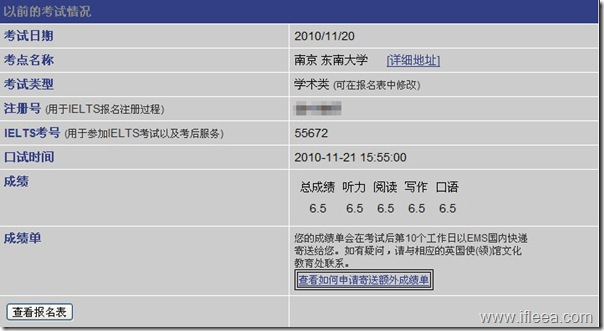

这次终于可以对着上次那尴尬的成绩单潇洒地说声：xxx 了。虽然这次考试听力有所遗憾，但是口语的大爆发让我虎躯一震，着实哈皮~像上次一样，写一个回忆性质的日志，记录这一段2B时光，也希望能对需要帮助的人有所帮助。 纯菜鸟级的路子，大神就可以略过了。[［来自ifleea.com\]](http://www.ifleea.com/931.html)

先说说时间安排，我是9月中旬开始复习的，中间用一周的时间做了作品集，还有几周有课的时间也没那么专注。  毕竟大四，这复习的快两个月只有3周有课，而且任务不重。  我专心复习雅思的时候，每天早上8：30起床（大神，牛人完全可以忽略我，我懒，起得晚），这还要感谢MOMO同学每天辛辛苦苦叫我起床。起来洗洗脸刷刷牙吃吃早饭冲杯咖啡，9点开始学习。[［来自ifleea.com\]](http://www.ifleea.com/931.html)

\----------------早晨的安排---------------------

早上的任务是听力和单词

1.  9点到10点的时间是听写新概念4的时间，不求多，每天一篇，全部听透写出来为之。

2.  10点开始稍微休息一下，短暂休息，然后作一篇雅思听力，from J4 to J7  ....  

3.   基本上40分钟搞定，然后对对答案，再休息休息，11点开始背单词，俞敏洪那单词，2个lists就够了。 

4.  11：40，早上结束，去吃饭，回来上网。

\----------------下午的安排---------------------

下午的任务是写作和单词/口语

1.  下午2点开始学习，抄写3篇大作文范文，然后提取论点，论据，文章机构，和精彩句子。小作文我一共总结出7篇，全部手抄珍藏，所有小作文跑不出这7篇，所以没什么后顾之忧，3天就把小作文复习完了。

2.  4点左右，开始背单词，还是老俞那红包，继续两个lists.  没有多久，就会发现词汇背完了，那后来我用4点到5点半的时间来写口语。

\----------------晚上的安排---------------------

晚上的任务是阅读和口语

1.  晚上7点半开始学习，我也只有这个时候才去教室自习，别的时候都在宿舍。 在教室可以非常精力集中不被打扰。 7点开始这一个小时是阅读时间。 限定时间做真题，刚开始的阶段是练习做题方法和技巧，后来两周就是练习对时间的把握。

做完一套，再订正答案之后，稍微休息一下，开始写口语。

2\. 继续写口语话题，直到9点半或者10点，自己实在不想看，出四号门，吃夜宵，回宿舍。

3.  回到宿舍上网看电影聊QQ吃喝玩乐一直到11点多12点个样子，下载当天的BBC, 装进MP3，上床伴着最新BBC睡去。

基本上听每天的BBC，前15分钟能做到仔细听，15~20分钟模模糊糊感觉自己在听，后面就完全没知觉了。 除了有一天说我们伟大领袖习近平同志的，我听的可开心了。

[［来自ifleea.com\]](http://www.ifleea.com/931.html)

\-----------------------------------------------------

说说单科的复习

1\. 阅读

无他，就是读。

J4,J5J5J5,J6J6J6,J7J7J7，读。

阅读水平很重要。

2.  听力

无他，就是听。 

新概念4听抄是绝对的完美路线，每天早上听完一篇新概念4，然后再听雅思就会觉得雅思好和谐， 不过不排除雅思听力里面有些2B老教授的奇异发音。

还有就是BBC，管听懂听不懂，坚持听，听着听着就能跟上了。

到能跟上的时候，试着抛开中文去理解，BBC说的比较多的就是什么选举啊，冲突啊，地震火山海啸，其实事情不复杂，试着用英文理解英文，慢慢的就会发现听力有大提高。

当然，你们完全可以忽略这一段，我听力仅仅6.5  …..

3.  写作

a. 小作文

    小作文最简单了，无非7种：饼图，线图，柱状图，数据表，地图，流程图，数据表+其他。

    每种写法都复习到，就不愁了，这东西，纯叙述，写不出深度。

b. 大作文

    我把所有话题的作文全部从范文当中提取论点+论据。  然后用一个本子整理出来。 其实当总结了所有范文之后，就会发现无非几大类，economy，culture，education，sci&tech，population，history，globalization。 每个话题自己都储藏写正反面的论点论据，无论出什么题，都往这几方面靠，肯定是没问题的。

ps. 关于模板，我是不敢用，不过我在各个范文当中总结出了自己的一套写法，算是一种模板。

4\. 口语

我是考前3周开始复习口语的，在网下下了一篇预测-其实这个预测基本上就是所有话题全集，然后全部按照自己的情况把所有的答案写下来，不用太强求背下了，也不需要像大作文里面那些长难句，大从句之类的，简单，自然，表意清晰就行了。  

自己写的怎么都会有印象，虽然突然被问到不很流利，但都是真实的东西。

我口语的话题是  a new law. 我自己准备过的，我没有从网上直接搜索答案然后背诵，我是上的wikipedia上面搜的 《中华人民共和国劳动合同法》，维基百科上面有英文版本，我摘取一点内容，剩下的自己加了这法律出台之后，劳动者得到保障，劳动者和用工者直接冲突减少，社会稳定之类的套路，其实和写作套路差不多。

第三部分恶心了，问我警察，律师，打官司。  这些都是我没准备过的，不过我都按照自己的想法说了出来，全是简单句，不过我记住了使用逻辑词和一些连接词，磕磕绊绊呃呃啊啊也算说完了。 但是，都是真实的，都是自己的，没有从书上网上背诵一点。

总的感觉，口语还是要一个“真实，自然”。

[［来自ifleea.com\]](http://www.ifleea.com/931.html)

\--------------------------------------

暂就这些，还有什么，留言交流吧。

也感谢豆瓣，51ielts，willing大哥，以及abby老师的帮助。

[［来自ifleea.com\]](http://www.ifleea.com/931.html)
