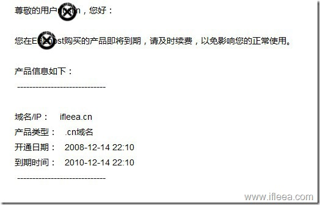
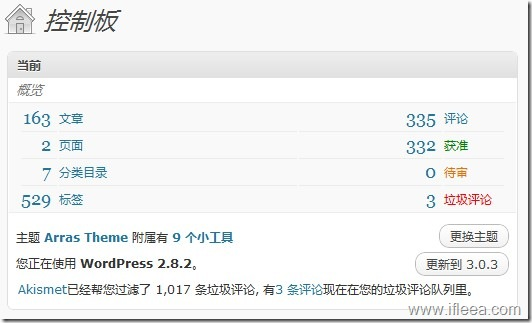
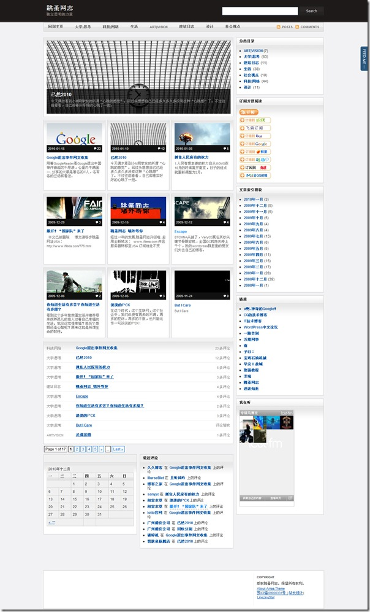

 

各种原因，ifleea.cn将在明天下线。完成它两年的使命。域名也不再续费，今后ifleea.cn将与我没有任何关系，而利用ifleea.cn域名产生的任何后果也与我无关。

ifleea.com正式接过这一接力棒。

 

ifleea.cn 上线于2008年12月，几经搬家调整，最后一篇更新于2010年1月15日，共有163篇文章，335条评论，7个目录，529个标签。

由WordPress强力驱动，起始版本WordPress2.6.x，终结版本WordPress2.8.2

死前主题：Arras Theme 3.5。

根据CNZZ数据统计，历史累计：累计PV 54040, 累计独立访客：42417，累计独立IP：20182。

<最后一张截图给ifleea.cn来张遗照>

ifleea.cn 是我正式使用的第一个域名，它也很遗憾地见证了中国网络环境的每况愈下，见证了cn域名从所谓“个人最佳选择”到“个人不允许注册”。见证了备案制度从“网络备案”到“站长拍照”到“签订责任书”再到封杀个人。

再见，ifleea.cn。
