先亮一下成绩单：

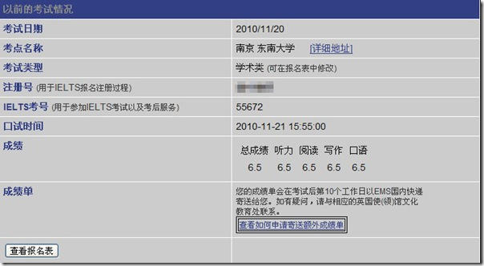

说一下我的四六级成绩，以作参考，看看您的水平和我是不是一样，再来看我的书目评价。

我四级471，六级432，通过几个月的努力，终于拿到了雅思梦寐以求的分数。

我用的复习的书：

[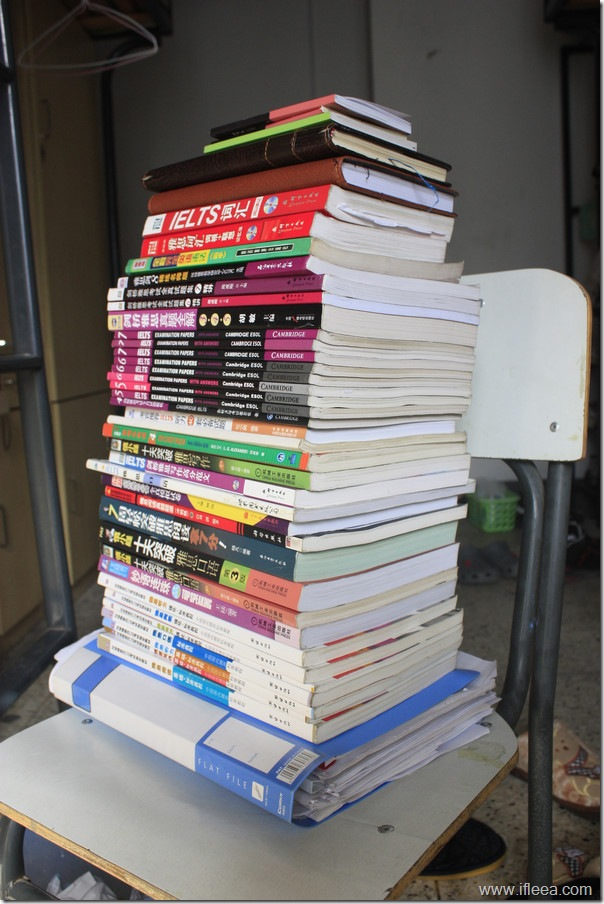](http://www.ifleea.com/960.html)

上次说了雅思的考试回顾，传送门：＜[雅思回忆，从6.0到6.5的完全历程](http://www.ifleea.com/931.html)＞，这次来总结一下用过的书，顺便做一点评，方便屠鸭ers 积极备考。

\--------------------------------书目汇总------------------------------------

按照上图中的顺序，分别是：

······**个人打印材料**

······环球雅思教材：**基础阅读，基础写作，基础听力，口语标准教程，强化写作，强化阅读，强化听力**

······口语用书：**王陆807妙语连珠， 慎小嶷十天突破雅思口语第二版（盗版），慎小嶷十天突破雅思口语第三版（正版）， 雅思口语**

······阅读用书： **七周轻松突破雅思阅读拿7分， 雅思阅读真题题源， 剑桥雅思必备全真模拟试卷**

······写作用书： **剑桥雅思写作高分范文， 慎小嶷十天突破雅思写作第3版**

······听力用书： **新概念英语4， 考官推荐IELTS听力40套必备试题**

······剑桥雅思官方真题：**俗称 剑4剑5剑6剑7. & 对应的试题精讲**

······**雅思剑8名师精炼版**

······语法用书： **全程完全英语语法（高中）**

······词汇用书： **雅思词汇词根+联想记忆法， IELTS词汇-词以类记**

\--------------------------------各书点评------------------------------------

##### **我的评价分为几类：极其推荐，推荐，一般，不推荐，打死都别买**

我按照书目顺序讲解

1\. 环亚的教材

我不知道市面上有没有买的，个人感觉一般，不做也罢，我的复习没有放很大的精力在这个上，基本上每个教育机构都会推出一些比较二呼呼的教材糊弄人，所以，有就看看，没有也罢。

\---------口语部分-------------------

2.王陆807妙语连珠

[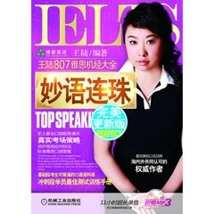](http://union.dangdang.com/transfer/transfer.aspx?from=P-285158&backurl=http://product.dangdang.com/product.aspx?product_id=20267366&ref=search-1-pub)

推荐

这本书是我的雅思口语启蒙教材，不得不说初期仔细阅读背诵这些对口语是有很大帮助的。

适合初学雅思，来建立口语感觉的，而不适合考前背诵抱佛脚，因为，所有背诵都是自寻死路。

2.慎小嶷十天突破雅思口语

[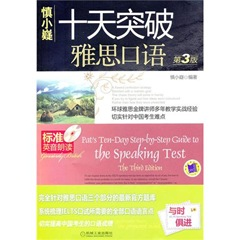](http://union.dangdang.com/transfer/transfer.aspx?from=P-285158&backurl=http://product.dangdang.com/product.aspx?product_id=20892501&ref=search-1-pub)

推荐

由于慎小嶷名气之大买了这本书，整体感觉还不错，能够学到更加自然地道地用英语说话，比较推荐。

不过雅思口语是个真实的对话，所有网上或者书上抄来的答案都是不会得到高分的，要懂得原创。

3\. 雅思口语

[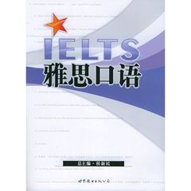](http://union.dangdang.com/transfer/transfer.aspx?from=P-285158&backurl=http://product.dangdang.com/product.aspx?product_id=9052529&ref=search-1-pub)

推荐

相对于上面两本动辄四十五十的坑人定价，这本书定价15，简单河蟹，当当还有打折，快赶上盗版书的定价了，而且这本书是练习册性质的，自己翻译，自己填空，可以创出自己的答案，是本好书。

\---------阅读部分-------------------

4\. 7周轻松突破雅思阅读拿7分！

[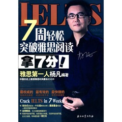](http://union.dangdang.com/transfer/transfer.aspx?from=P-285158&backurl=http://product.dangdang.com/product.aspx?product_id=20804452&ref=search-1-pub)

极其推荐

这本书还是不错的，至少我从里面学会了怎样安排考试时间，深化各个小题的解题技巧。

这本书开始讲解题技巧，后面有很精彩的讲解提升阅读能力的方法，很不错。

我雅思阅读的复习仅靠此书。

５. 雅思阅读真题题源

[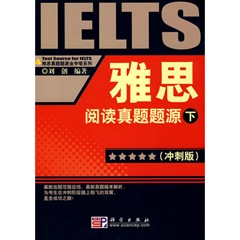](http://union.dangdang.com/transfer/transfer.aspx?from=P-285158&backurl=http://product.dangdang.com/product.aspx?product_id=20473839&ref=search-1-pub)

打死都别买

此书真的很垃圾，题目的设置只要能找到文中出现的地方就能拿分，完全没有雅思阅读题目设置的精髓。

不过就文章来说，还是不错的。

６. 最新剑桥雅思必备全真模拟试卷(含盘)

[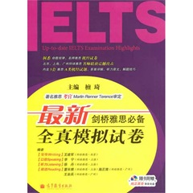](http://union.dangdang.com/transfer/transfer.aspx?from=P-285158&backurl=http://product.dangdang.com/product.aspx?product_id=20882948&ref=search-1-pub)

一般

当J4 J5 J6 J7 都被你做了个遍。苦于无题可做的时候，这个书就从众书丛中跳出来了

\---------写作部分-------------------

7\. 剑桥雅思写作高分范文

[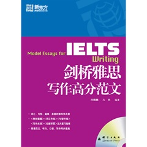](http://union.dangdang.com/transfer/transfer.aspx?from=P-285158&backurl=http://product.dangdang.com/product.aspx?product_id=20705343&ref=search-1-pub)

极其推荐

涵盖所有话题大作文，我用它一方面当我的论点论据提取的素材，提升写作词汇的教材，几乎成了复习写作的重要材料。 好好研究这本书，提升颇大。

8\. 慎小嶷十天突破雅思写作第3版

[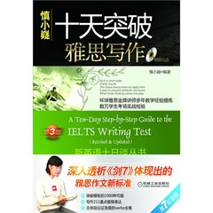](http://union.dangdang.com/transfer/transfer.aspx?from=P-285158&backurl=http://product.dangdang.com/product.aspx?product_id=20636890&ref=search-1-pub)

一般

纯粹的个人感觉，也许是我多用上面的那本，这本书忽略的缘故。不过慎小嶷的写书风格还不错，轻松自在。

\---------听力部分-------------------

９.新概念英语4

[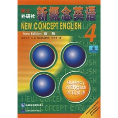](http://union.dangdang.com/transfer/transfer.aspx?from=P-285158&backurl=http://product.dangdang.com/product.aspx?product_id=20281225&ref=search-1-pub)

极其推荐

提升听力的极佳素材，每天听写一篇，保证听力大突破。

啥也不多说了。

10\. 考官推荐IELTS听力40套必备试题（附赠MP3光盘）

[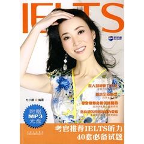](http://union.dangdang.com/transfer/transfer.aspx?from=P-285158&backurl=http://product.dangdang.com/product.aspx?product_id=20804134&ref=search-1-pub)

推荐

封面这风骚的美女老师挡不住书里不错的听力试题

每天早上都完整听一篇，保持听力还不错。

\---------剑桥官方部分-------------------

11\. 剑桥雅思 J4 J5 J6 J7 系列

[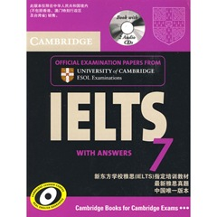](http://union.dangdang.com/transfer/transfer.aspx?from=P-285158&backurl=http://product.dangdang.com/product.aspx?product_id=20612336&ref=search-1-pub)

极其吐血推荐

这个还要多说吗？

12\. 雅思剑8名师精炼版

[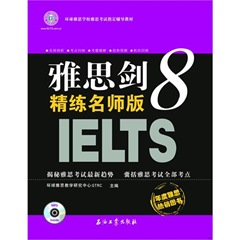](http://union.dangdang.com/transfer/transfer.aspx?from=P-285158&backurl=http://product.dangdang.com/product.aspx?product_id=20861578)

推荐

整体来说还行，山寨版的剑桥雅思，环球雅思出的书，题目较为简单，适合考前热手树立自信等用途。

\---------语法&词汇部分-------------------

13\. 全程完全英语语法（高中）

推荐

这本书当当上找不到图，囧。

在复习雅思初期，我用这本书复习了几大时态，几大从句，简简单单的看看而已。

我其实不喜欢纠结于语法，雅思考试本身也是，所以，只要你懂了就行，这个是基础的基础。

14\. 雅思词汇词根+联想记忆法（附光盘）

[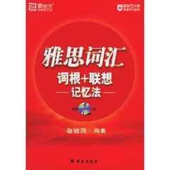](http://union.dangdang.com/transfer/transfer.aspx?from=P-285158&backurl=http://product.dangdang.com/product.aspx?product_id=9123351&ref=search-1-pub)

极其推荐

屠鸭ers怎么可能少了一本词汇书，相对于词以类记，这本书还是简单河蟹一点，35个lists，便于计划，也很容易就背完了。

15\. IELTS词汇-词以类记

[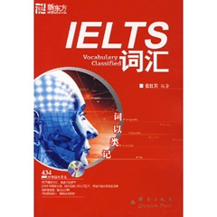](http://union.dangdang.com/transfer/transfer.aspx?from=P-285158&backurl=http://product.dangdang.com/product.aspx?product_id=20027050&ref=search-1-pub)

推荐

我是没有完完整整背下来，这本书比上面一本深奥好多，适合大牛们使用，像我这种草根就略过了。

\---------------------------------------------------------

总结，**本文中的图片都来自当当网，每个图片也都直接连接到了当当。**

**书在人用**，我写的评价都是从我个人使用角度的总结。

不一定完全适合您，不过也应该有些参考价值。

[来自ifleea.com](http://www.ifleea.com/)
