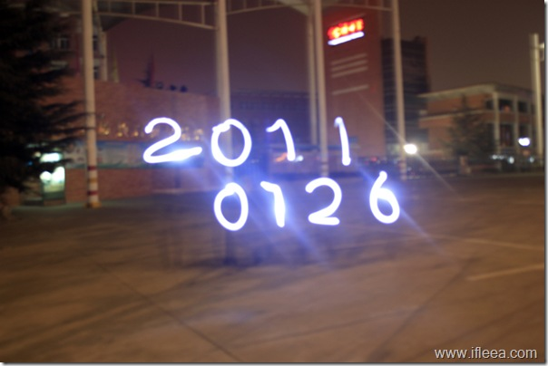

器材：

相机：450D+狗头

        500D+狗头

        cybershot卡片机    用于给人加闪光曝光

辅助：三脚架x2  一台相机一个

        手电x2

        电光烟花x30  实际消耗3

地点： 宝中门口小广场  ---地理位置偏僻，人少好办事

时间：19:00 ~ 22:00

人物：腮姐，曾哥，孟爷，我

开始之前腮姐，曾哥和我在老王面馆吃面。 如今的老王已经花白了头发，想高二时候他给我们送饭的时候还是黑的。文理学院已经放假了，终究还是没有勇气往里闯，其实还挺向往那里面的漆黑黑的角落的。

其实第一次玩这个东西，更多的是一种实践和探索。 今晚也是越来越顺，出片也越来越好。几个人寒风中黑乎乎的地方架起相机在路人看来的确挺二，但是慢慢的自己玩儿hi了也就不在乎了，反而有些自豪自己做的事情。

简单总结成以下几点

1\. 曾哥比想象中的活泼

2\. 腮（取字音）姐比想象中的有才

3\. 孟爷比想象中的娇羞

4\. 活人比想象中的难抓

5\. 对焦比想象中的吃力

嗯，下一次见。

精选照片请移步：[http://www.flickr.com/photos/ifleea/sets/72157625911519674/](http://www.flickr.com/photos/ifleea/sets/72157625911519674/)
