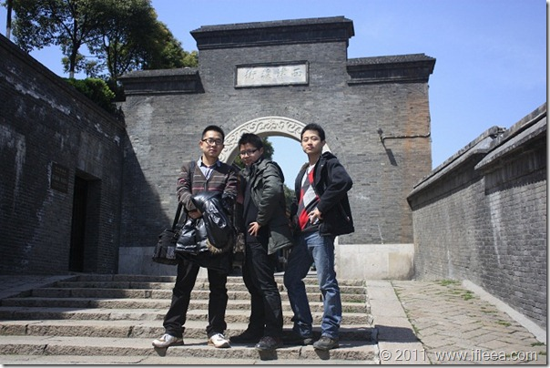

图中从左到右：博主，飞锅锅，龙姐姐。感谢此刻辛勤工作在镜头之后的草哥哥。

今天是2011年3月25日。镇江一日游。

首先感谢万能的铁道部，让我们来回只能坐高铁，回来的时候还没发5100水。

15分钟的高铁车程的感觉就是，还没开，妈的到了，31块钱的票就算废了。

然后，感谢万能的网络，哥凭借被阉割的google，未被阉割的google earth，没阉割就像被阉割一样的百度，成功做足了功课，一天的公交线路心中有数，井井有条。而镇江也给我们一个惊喜，袖珍的城市，每次坐车都没过5站，很好。 可是镇江火车站那恢弘的气派、火车站地下九曲十八弯的交通系统着实和城市的规模产生了鲜明的对比。

今天的行程很简单，总共3站：1. 金山公园；2. 西津渡；3. 市中心。

金山公园还可以，赶上了小学生的春游，哪哪儿都是小学生，哪哪儿都是比春天还火爆的青春期的精力过剩。感受很简单，景不错，园不错，小朋友们更不错。

西津渡，很美很推荐而且免费的。 有点像北海老街那样的格调，旧房子，石板路，西津渡的路很窄，同样九曲十八弯，围绕在一坨不大不小的山包上。面北。

坐车到达市中心的时候，我们都在找市中心。嗯，的确和南京比，萧条的不止一点。但是回头想，小城市，这样多好。

不得不说的是镇江的天，虽然只喝南京有15分钟的高铁车程，但是镇江天的清澈是南京几乎不曾出现的。

镇江的人也挺地道，在景点、在火车站买水喝， 都已做好被宰的心理准备，结果未果。
