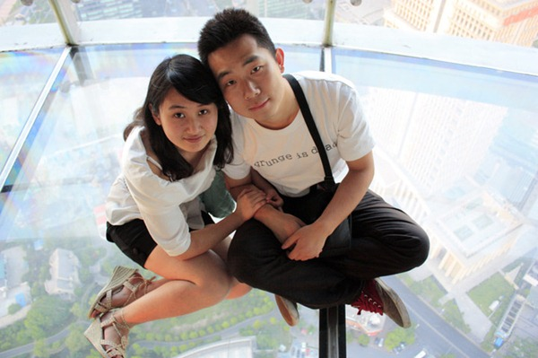

也不知道是5月忙着毕业这一套东西，还是筹划着MOMO第三次南京之旅&上海蜻蜓点水游，博客从4月到现在一直没有更新过。

5月买了个包月VPN，上twitter上youtube自在多了，虽然只有10块钱一个月，但是比免费的不知道好多少倍。

昨天MOMO坐上了回学校的火车，今天我也坐在这里回顾回顾我们的上海行。

29号晚上我高铁从南京到上海虹桥，住在格林豪泰虹桥机场店，还不错，晚上11点在机场接到MOMO，也跟妈妈短信报了声平安。第二天是典型的上海市区景点游，在此感谢成栋哥的照顾，同时也能深刻感受到上海这座城市带给年轻人巨大的压力。南京路，外滩，陆家嘴，东方明珠，豫园，走马观花般流过。拿着手机看着百度地图找坐标的确是一件乐事。

31号去了田字坊，成栋推荐，也正好是地铁沿线，很方便就过去了，在上海有这么一小片地方承载着艺术、伪艺术，格调、伪格调交织起来的另类氛围的确很不错。然后就是一天的轨道交通蛋疼一日游。上海，我们没有坐公交，没有买地图，轨道交通很方便。

31号晚上的动车回南京，两个人的两个半小时果然快得过一个人的一小时十五分。
