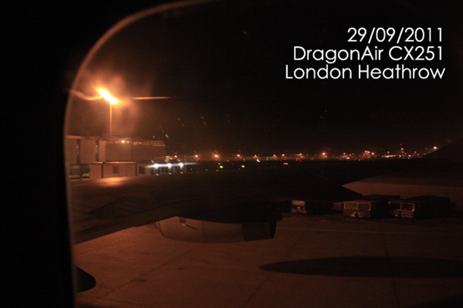

First Sight..

 

现在是英国时间2011年10月2日晚上21:30，我到英国也整整3天了。

总要写点东西来记录一下现在的日子，记录这种空降到另一个国度真实体会。

 

首先体会就是这里的交通，大部分都是柴油车，而且车速非常快，无论是在从机场到莱斯特这边的道路还是在loughborough当地的窄路，车都跑的飞快。 我开始还很担心，可是慢慢的发现在车速快的背后还有井然的秩序。无论在哪里，转弯、上路都是要严苛地让直行，大家都很遵守交规，无论你开法拉利还是破旧的toyota，在很多路口和有行人通道的地方，车会主动停下来，车主给你挥手让行，这在国内都是不敢想象的。

 

然后就是这里的人，在哪里都非常热情客气。每天出门需要说的最多的话就是thank you，干什么都说，不停的sorry / excuse me & thank you . 无聊走到哪儿都非常热情耐心。 我在银行办理银行卡的时候，那个大婶很热情的接待，而且跟我讲讲她外甥女去上海读书啊，中国很不错啊之类的，而且也开开玩笑享受生活，虽然我只能听懂40~50% . 今天走在ashby road 人行道上，听到后面有自行车声，我侧身站立让行，那大姐很不好意思的说，sorry，anyway I shouldn’t be here, but…  Thank you! ，我微笑而过。 我喜欢和黑人朋友握手聊天，他们很幽默，语言水平也和我差不多，而且黑人独有的嗓音很好听，很吸引人。

 

生活方面问题还是挺多的，语言的障碍是很大的难题，走在外面大部分都听不懂，去超市买东西还好，有钱，识数就行。我早上去了O2的手机店，3mobile和orange的店，店员说话基本听不来，没办法要了两个booklet就走人了。

 

明天早上是Design School 的 Inducion Day，很期待去认识世界各地来的工业设计人。
