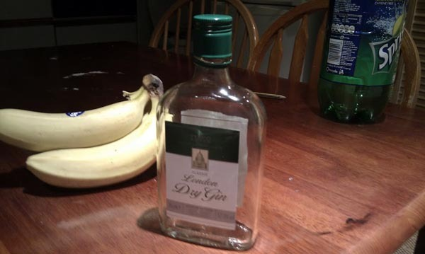

很久没喝烈酒了。  今天成功冲破deadline，下午开心去超市买了瓶Dry gin，出来买酒就认识jack daniel，Vodka，还有几个在朋友家喝过的几种。 买酒纯属看着酒精度买，拉夫堡中国超市的二锅头19.25英镑一瓶，在国内都可以喝一瓶半海之蓝了。 

今晚下面条吃炒肉喝酒，快活。37度的酒还是不能和二锅头比凶狠，而且Dry Gin 一种微甜略香的口感，回味有些酒精味儿，只有胃部的感觉和二锅头一样。   也算是9000公里之外的一种怀念。

我喜欢偶尔适量喝喝酒，特别是大冬天喝点儿白酒。 酒精让头脑跳跃出平时正常情况运转，一点点酒精使人兴奋，更多使人上情绪，再多就不能控制了，就像去年的这一次喝醉：[http://blog.natt.cc/965.html](http://blog.natt.cc/965.html).

无论如何，假期来了，自主的时间来了。 一个月的时间，圣诞、新年。 酒慢慢喝，路慢慢走。
