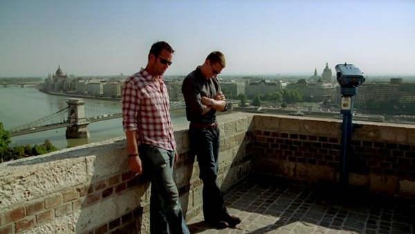

发个娱乐贴。

昨天迎来了圣诞给自己的第一个小礼物，full-size 耳机一枚，这大物件挂在头上看电视剧真是爽到爆。 Deadline冲过之后成功的24小时内看完了Strike Back 第二季。  和第一季一样，讲的是无敌基友的故事。 第二季中，一个美国Buddy和一个英国mate共同维护宇宙和平。 美音英音交错之中让人不禁赞叹无论英音多么有气质，还是美音更加吸引人。

不到一周看完两季的结果是在第一季中伟大的修女在第二季变身成为医生之后，还是有点点总想着她是修女。  就像第一季中看到BOSS的时候觉得他是打完了 walking dead 然后回来当BOSS的，Terra Nova 计划失败之后无敌的爹回到中东继续无敌。

很期待什么时候能拍一拍在中国的行动，比如什么福建大土楼地下暗藏核武器发射井、中国功夫成功干翻了剧中最爱出现的路虎卫士而成为世界第一的螳臂当车的歹徒、各个猪脚配脚不是被枪崩死也不是被炮炸死而是吃了路边不明食物而暴病身亡。   天天在中东啥恐怖分子看着看着就烦了，来这片神奇的土地找找新思路吧。

还有就是各种XXOO的镜头，放进去也太牵强了，为了有镜头才有的镜头，都是什么上班前Refresh一下自己来一把，下班后自己还活着来一把。 虽然妹子们都很漂亮身材很好，但是这些内容玩儿的不到位。

吹牛完毕，SB第三季来了还是继续看。
