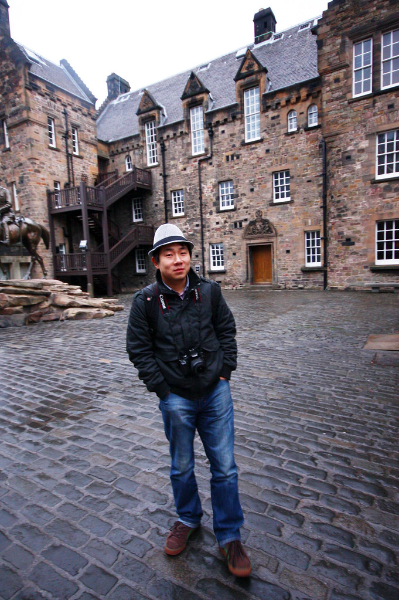
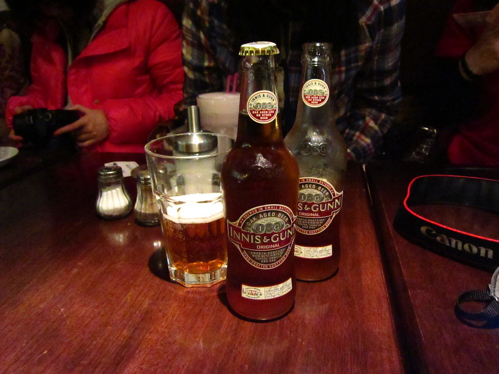
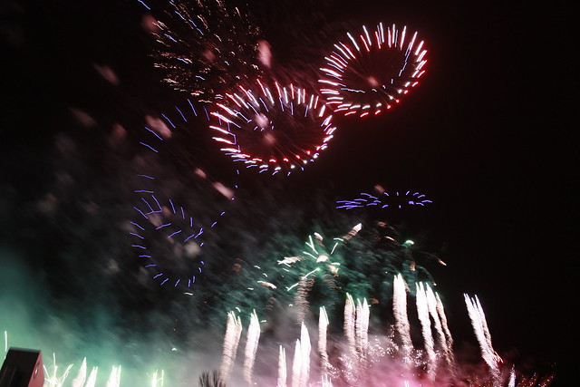
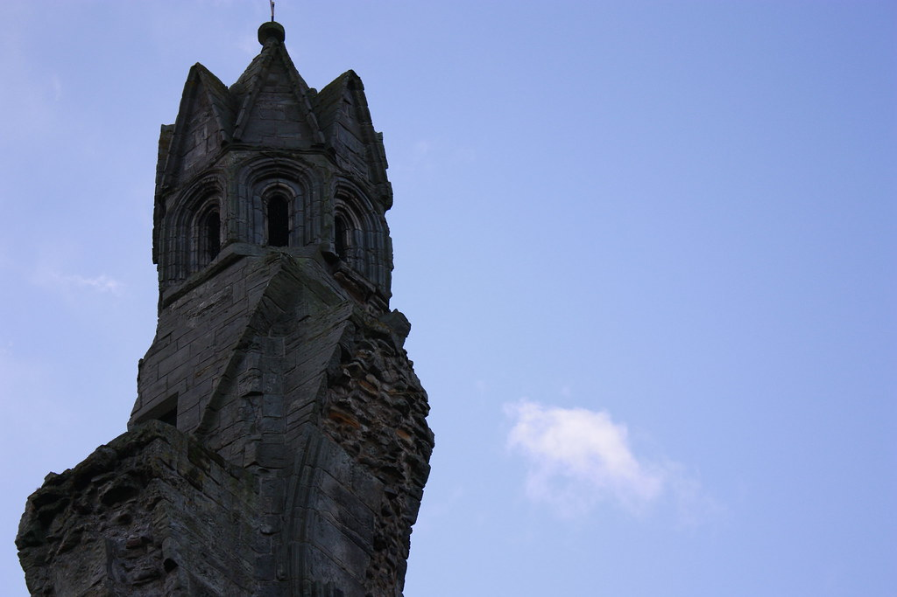
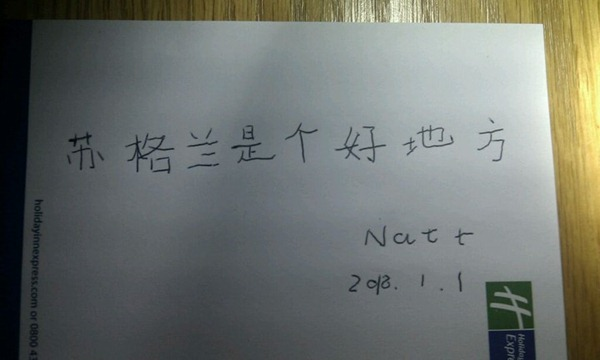

苏格兰4日游，from 30,DEC,2011 to 2nd,JAN,2012.

留学英国，每一天都是唯一的，仅仅一年时间，没有一天是可以在来年重复的。 元旦之前奔赴苏格兰，爱丁堡跨年夜迎接2012 。

photo by: [Abby Liu](http://www.flickr.com/photos/58759552@N04)

整个苏格兰没有一个人认识我，这种感觉很好，趁着进入爱丁堡的大风天买了个骚气的帽子也装一把小文艺青年。 无奈近年内体重上升，再文艺也骚气不起来了。

Photo by: Xiwei

我这种小啤酒爱好者也很自然的在某小cafe点了杯爱丁堡风味啤酒。INNIS & GUNN, 味道略甜，啤酒花味儿浓厚，有点像黑啤的感觉，但是没那么苦，口感清爽。  是个不错的小啤酒。

一天等啊等终于等到了倒数计时，3分钟的烟火对国人来说的确不算是什么big deal，但是全世界的人民汇聚在爱丁堡街头共迎新年的气氛还是相当有感染力的。遗憾的是国内的孩子们已经在8小时之前提前进入2012，不能跟国内的孩子们分享跨年的喜悦。   有情人的带情人，没情人的找路人，这都是一个好地方。

虽然停留的时间简短，但是不得不说苏格兰给哥哥留下最好印象的还是 圣安德鲁斯/ St. Andrews，与世无争的海景，静谧的小镇和打高尔夫的惬意，想想美好人生不过如此。站在St. Andres Cathedral 废墟下用相机对着曾经的教堂顶等一朵风骚的云飘过，上图中的云虽然没那么风骚但也70分往上了。 感谢那天的好天气，感谢这老教堂和这一小朵风骚的云。

嗯，我很主观的随便扯了扯苏格兰的几天，再美的行程还是要自己体验，更多图片参见[FLICKR](http://www.flickr.com/photos/ifleea/), 谨以上图结束这次旅程。
