复活节两周假期，回国太短，去欧洲签证那些事儿太麻烦，在网上做了些功课之后还是决定租车出去散散心。

 

首先遗憾的是胎死腹中的苏格兰计划。  不过，我还是会去的，苏格兰，等着哥。但这一周靠着一辆小小的嘉年华，去了莱斯特Leicester，诺丁汉nottingham，谢菲尔德sheffield，斯旺西swansea，卡迪夫cardiff，利物浦liverpool。 足迹遍及 大半个大不列颠岛。 不过都是和基友们去的，把媳妇给冷落了。

 

首先说说英国的开车。  英国人民开车很绅士，我租车一周，自己开了也有将近200迈，一次喇叭都没有按过，被后面的车按过一次喇叭（出环岛变道的时候没有打转向灯）。 高速连接的环岛处起步也熄过火，后面的车安心等着我重新打火，太和谐了。 远远的就相互让路，对面来车相互让路，我变道打转向灯后面的路虎捷豹都给让路，实在是有点害怕回国不会开车了。

 

莱斯特 诺丁汉 谢菲尔德 都算是练车熟车的过程，真正的旅程始于威尔士 斯旺西。

 

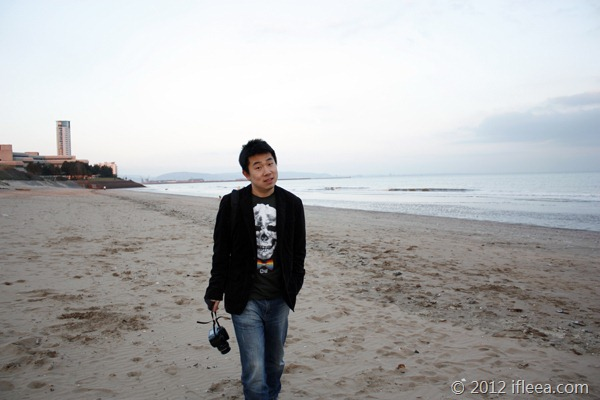

斯旺西是个平静的海港城市，有一个漂亮的海滩，整个城市有点像去过的广西北海。 斯旺西人民口音不重，交流无碍。可以想象如果这里阳光明媚将是一种怎样的和谐安逸。在斯旺西时车停在酒店停车位，免费。

 

第二站 威尔士首都卡迪夫。

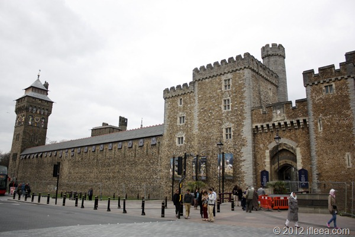

卡迪夫是威尔士的首都，到底是比斯旺西热闹很多。 卡迪夫市区很容易找到这个漂亮宏伟的城堡，门票学生票 9个胖子。卡迪夫停车位3胖子一天，很好很和谐。

 

第三站是个意---- Raglan Castle, 在A40高速边上的的某个地方，找加油站的时候找到了这个城堡，3.5胖子的学生票。 虽然已经是一片废墟，但是依然能领略到过去住在这里的主人的品味和英式的奢华。 因为是个非主流景点，所以感觉特别的好。

 

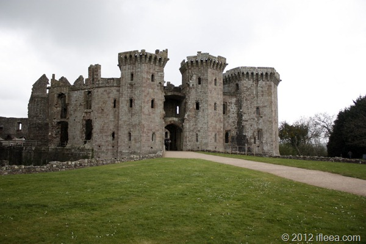

城堡大门，好不容易等到了没人的场景。

 

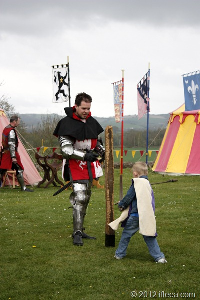

战斗吧，小勇士。

 

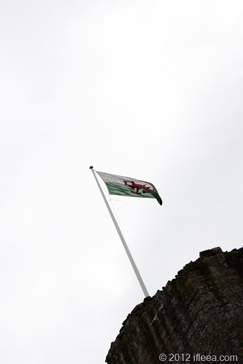

威尔士旗帜飘扬。

 

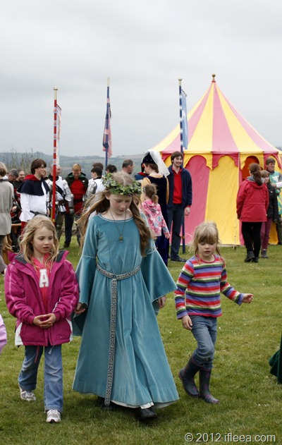

美女妹妹教你跳支舞。

 

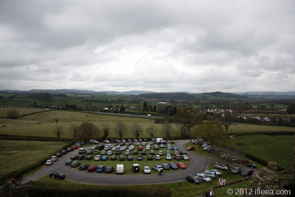

城堡门前停车场，没有线，没有收费，没有管理员，也可以停的如此整齐。

 

下一站利物浦，天气挺狗屎，一直在下雨，不大不小，撑伞多余，不撑淋雨。

[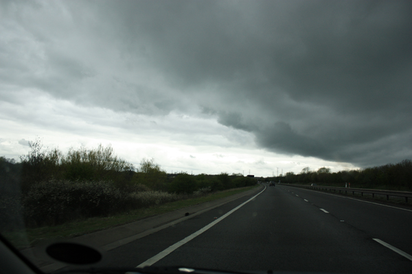](http://blog.natt.cc/wp-content/uploads/2012/04/MG_6272.jpg)

去程的天气，典型的英国天。

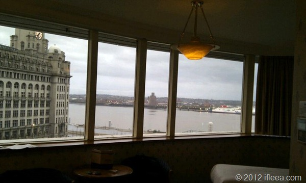

住在了这样的海景四星酒店。         可是，和另一个男人。

 

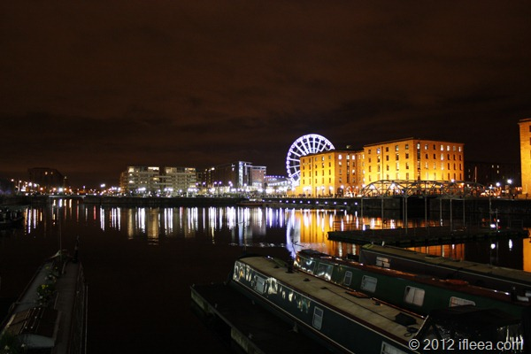

Albert Dock 夜景。

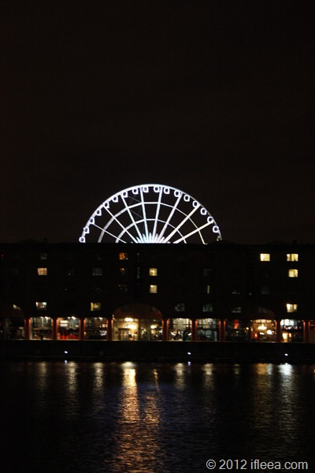

利物浦小摩天轮。

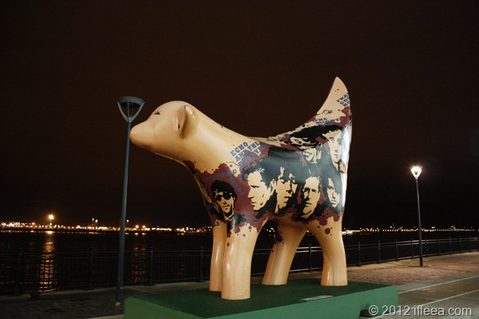

Lambanana, 小羊香蕉，利物浦的小代表。

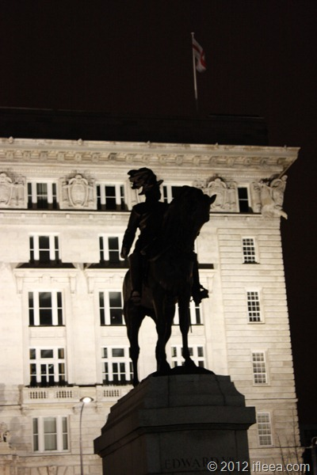

Edward VII.

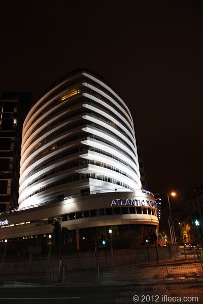

住的酒店。

 

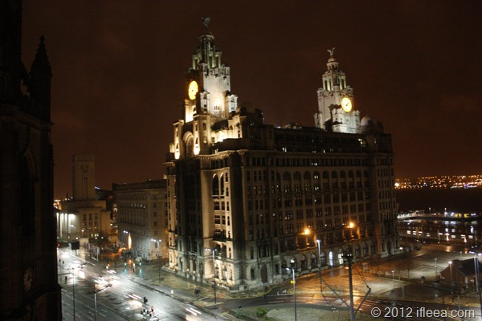

酒店房间夜景。

 

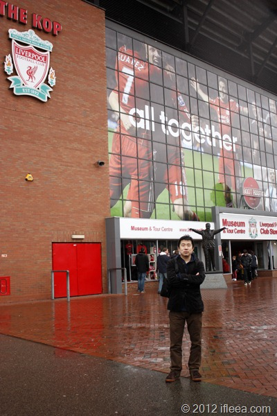

Anfield 球场。  小到让人不敢相信。

 

自驾游爽的就是想去哪就去哪儿，而且对比火车票飞机票还更便宜，哪怕算上租车钱。 全英国基本上所有道路都是免费的，高速路随便上随便开。 大家开车都很绅士，相互让路，耐心等待，在单车道的小路上从不超车。  只要不是自己撞树上掉沟里，是完全安全的事儿。

不爽的也有几点。 停车难，停车贵。 英国城市里车位很难找，基本上都是自助停车，如果企图不付钱很容易就会被罚款。 看到停车场在边上，各种单行转弯限制也让你挺不进去。 油费高，一升油基本上在 1.38 胖子到 1.45 胖子不等，但是油品好，最低95号汽油。 加给我租的小嘉年华的确是他的福气啊，英国的小车喝的油都比中国幸福。

 

本来想去征服苏格兰的，但是苏格兰恶劣的天气+超级远的路程还是让我改变了路线。

苏格兰，等着哥哥。
