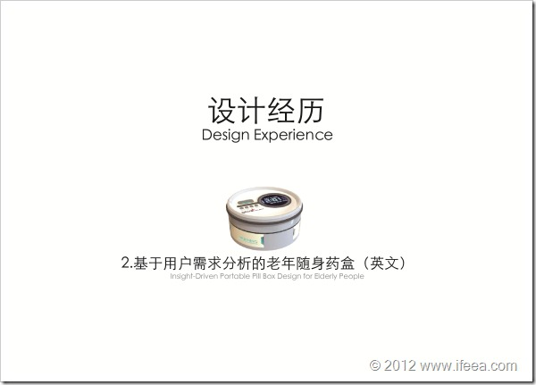

上面放的图是用来找工作的作品集中的一页，出自未完成的草稿，以此记录自己目前的状态，无论毕业后在什么岗位从事着什么工作，记得这个时候自己还是有进高校的高校梦的。准备简历的过程中才发现，原来从去年毕业设计到现在，也一年过去了，看看自己UK文件夹里面越来越多的内容还是挺欣慰的，付出的努力果然还是能看见一点的。

不知不觉又是一个月过去了，日子过得快无非两种情况，一是学习猛，二是玩儿的嗨。 不过这个月紧紧张张的状态每周一周五见两次导师的情况还是让人稍有些压力，既没学猛也没玩儿嗨。 一方面努力进行着自己的任务，另一方面也在着手做着个人简历准备毕业后的工作。

而在自己的内心，现在则更向往早早回国然后安定然后过简单的生活，做设计然后游山玩水，回到那个混乱的大漩涡当中闷骚的做点儿什么就好。 稍微有点浮躁，毕竟按照日历算也就不足四个月了，这么久都待在英国这地方的确有些憋闷想家，面临毕业后的未来也有些许期待，期待回到那片热土。

五月，有些浮躁。
