经过几日努力奋战加通宵一夜，昨天终于交完了作业，在小小的镇子憋了快两个月了，昨天迫不及待找目的地，于是有了今天的考文垂一日游，本来是一日游，由于我计划是睡到自然醒，就成了半日游了。  一个人出去玩的好处就是想什么时候走就什么时候走，想什么时候回来就什么时候回来，也不用跟人商量行程商量吃饭，自由自由很逍遥…

 

到火车站用 Young Person Card 买当日往返票，路程不长但却要两次换乘 ..

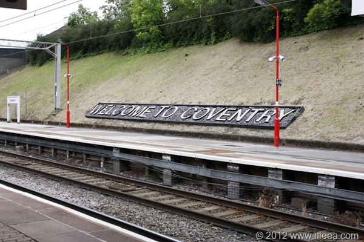

下火车，考文垂欢迎你。

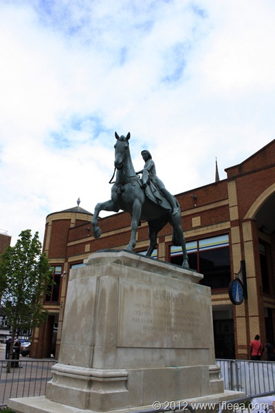

Lady Godiva  雕像.

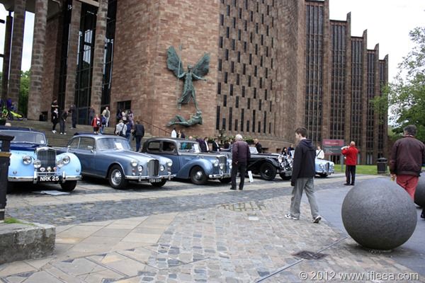

Coventry Cathedral, 今天门口摆了一堆神器，都是汽车博物馆开过来的..

不知道是天天如此还是偶尔一次，今天这个小广场摆满了古董车，酷到爆，激动的在广场徘徊一个多小时才走，下面发几个神器照片。

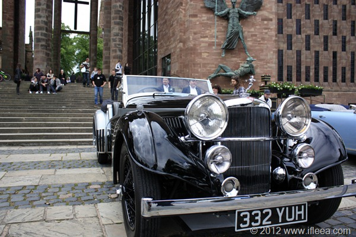

神器中的神器，私人定制1939款 ALVIS.

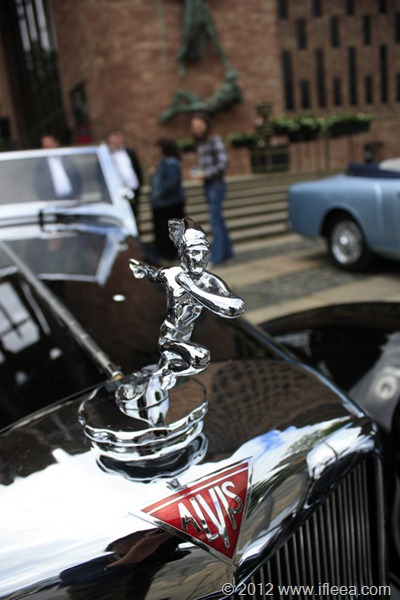

神器的车头特写。

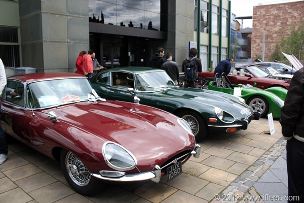

又是神器一对，Jaguar E-type，记得有一期TG里面 Jeremy Clarkson 把E-type吹上天了，今天有幸遇到两辆一起，围着转了无数圈啊，好激动啊。

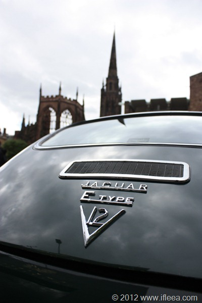

屁股，V12 .

[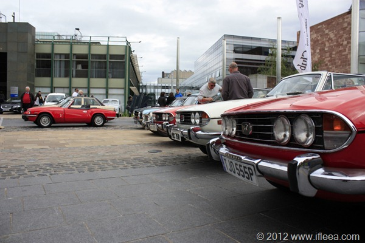](http://blog.natt.cc/wp-content/uploads/2012/06/MG_65821.jpg)

一堆 Triumph，我对这东西不很了解，不过这么一排摆在这里超级具有视觉冲击力…  跪了。

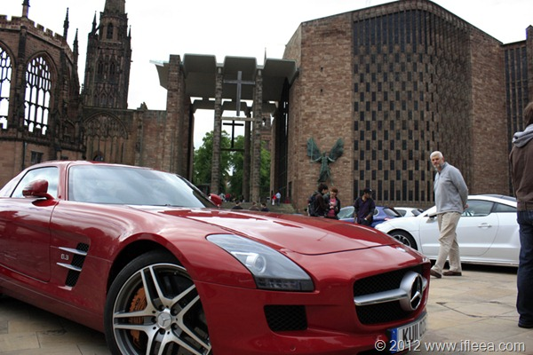

复古车之外，也有当今豪车。 SLS AMG 停在古典教堂广场，有如时空穿越，遗憾的是海鸥翅膀没张开，6.3 V8 引擎也没叫唤几声造点声浪吓吓人。

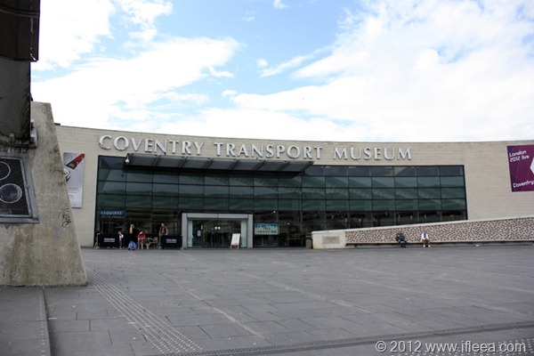

然后去了考文垂交通工具博物馆。 门票免费。

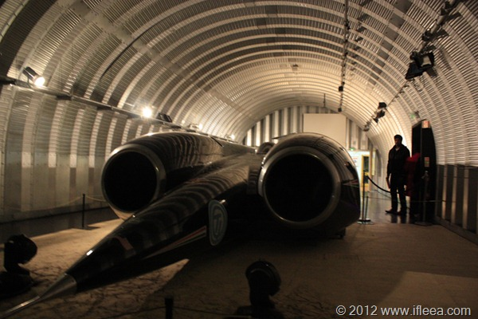

陆地最快速度记录保持者本尊，重达10吨，两个F4 战斗机引擎，50000cc引擎，每秒耗油18升…. 速度记录 时速763.035 mph, 也就是1278 km/h，也就是341 m/s

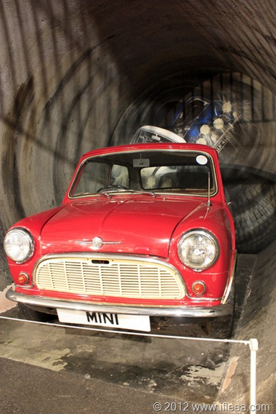

1960 Morris Mini.

 

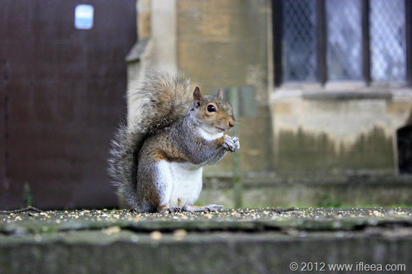

另外，这是最上镜小松鼠，距离我1米不到，这小家伙见人不跑，给他喂吃的开开心心抱起来啃 ...

 

考文垂真的是汽车爱好者的天堂，出火车站地上地下的人行通道直接把我转晕掉了，在路上还碰到了某暴躁同学的拉烟起步，开的捷豹XJ, 无论轮胎声还是引擎声都A+效果…

 

 

考文垂，与车同在的城市。
