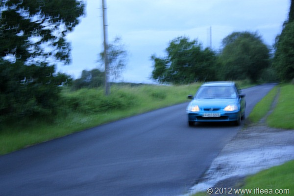

和这个图的昏暗感一样，这一个月一直处于浑浑噩噩状态，想出去玩也没下决心走远到哪儿去，想学习也没有导师压着天天拖拖拖了一个多月，狗屎天气也把自己憋在家里闷到死。今晚不知不觉聊聊QQ 听听音乐 看看人人 非死不可又到了12点。

月初靠自己出卖时间精力的收入买了辆小破车，1.4L 排量的小本田，英国这路况比较扯淡但是路上的车还是比较客气的，刚拿到车还不太熟悉时候有天下雨天大声听着许巍的歌在镇子上回家，一个上坡红绿灯排在第一位等红灯，也许许巍让我放松了，也许雨声让我听不到发动机的破声音，连续两个完美的三连点头熄火起步让我成功的在一个绿灯时间没有完成起步左转的动作，红灯再次亮起，后视镜看看后面堵了大半路的车了，没人按喇叭催我，这特娘的还不如按两声喇叭刺激刺激我，也好让我回国之后尽快熟悉。

之前在英国算日子是正着算，来了几个月几个月的，现在是倒数算，还有几个月几个月回家，夹在这中间的状态的确有些让人不知如何是好，一方面近一年没回家确实十分想念，另一方面在英国越来越久也确实适应了这种高度先进的社会，一种在中国未来几十年都达不到的秩序和礼节。英国一年学的不仅仅是专业知识，而是似乎穿越至未来感受一番而后继续回到自己过去的状态一样。

每个阶段都有自己的状态，这就是现在的状态，不管好坏，不论浓淡，随便写几句记录一下这个阶段的日子。现在的英国就如没有出梅的南京，雨天天要下，不同的是这里高温也就不到20度，凉快清爽，而此时，家乡正是仲夏。
