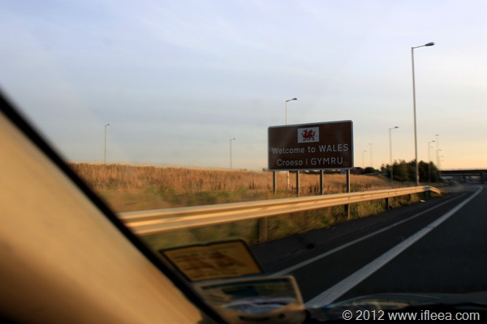
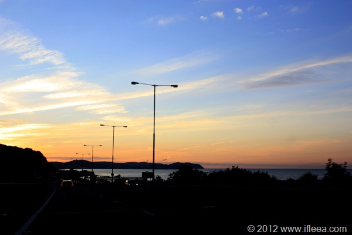
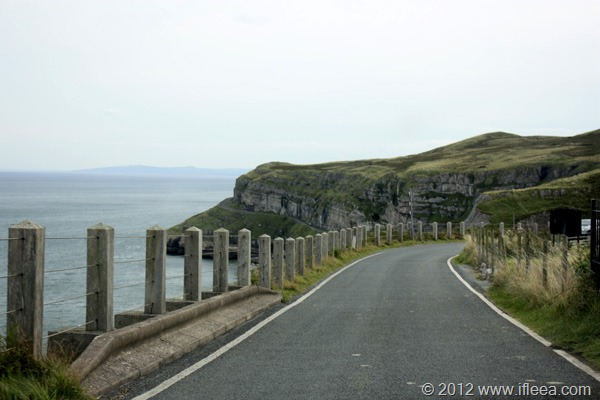
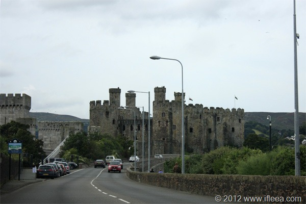
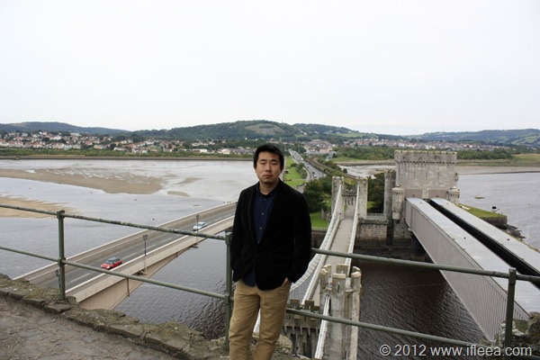
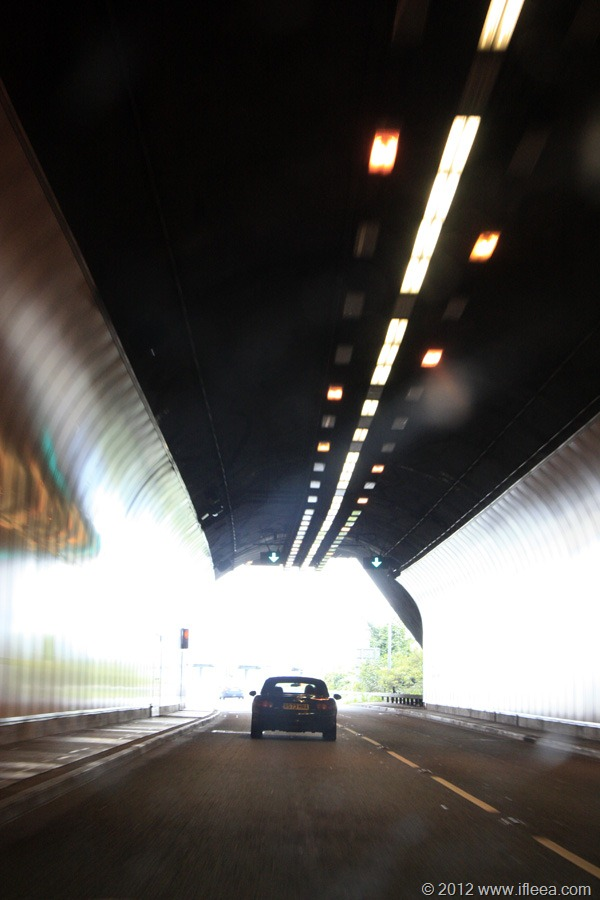
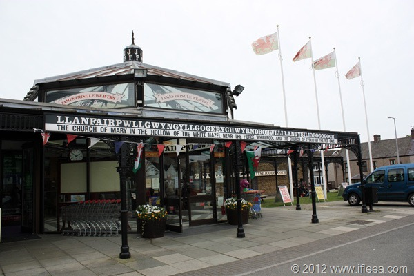
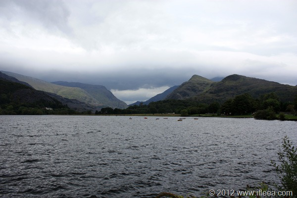
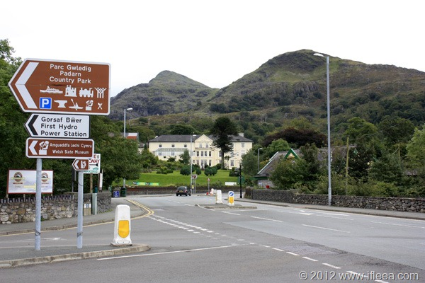
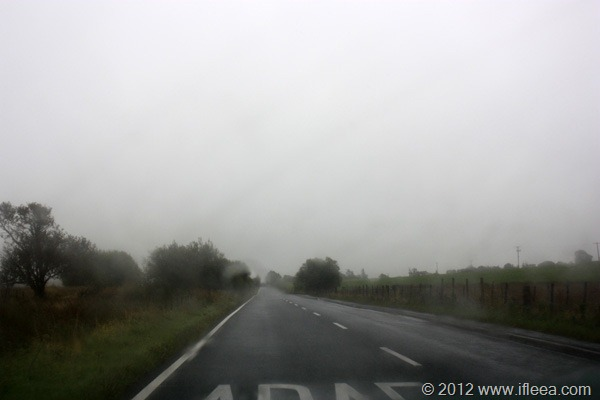

这注定是一篇长长的日志。

自驾北威尔士的计划始于8月中下旬，一边奋力搞Major Project 一边期待着提交之后的行程。 提前订好日程并订好酒店，最终于2012年9月22日启程。

由于紧接在伦敦之行的后面，第一天的行程是下午4点多出发，从拉夫堡驱车200多公里到达北威尔士小镇Llandudno。

迎着晚霞，进入威尔士境内。 这次成功的在高速上抓到了威尔士的地界牌子。

进入威尔士就离小镇 Llandudno 不远了，整个景色犹如天堂一般。 蓝天白云加晚霞，青山绿水加夕阳。 晚上住在镇上一家家庭旅馆，俗称B&B，Bed & Breakfast。 老板是个当地人，六七十岁的奶奶，热情的给我们Check-in，给我们指点了停车之后，告诉我们11点半就要锁门了，晚上出去早早回来。

和英格兰情况差不多，晚上除了少量餐厅和大量酒吧之外，整个小镇晚上没什么店铺是开着的。 我和小文同学逛了几圈之后决定去一家意大利餐厅吃饭喝酒。我点了一块三文鱼，他点了某不知名小鱼，另要了一升店家自酿的葡萄酒，味甜略涩，两人畅饮吹牛，感觉不错。

第二天一早，去超市买了食物饮水等补给之后，我们就开上了这样的环海山路，多漂亮的景色啊。 一个石头山半岛，三面都是海，一条环山公路把最美的景色呈现给游人。 手动挡的小车在这样的破路上确实需要些技术的。小文全程不敢开，而我就展示了完美的技术和意识，顺利平稳开完全程。

离开Llandudno之后的目的地是Conwy，另一个临近的小镇，有著名的Conwy Castle。

还没开上跨海的小桥，就看到了城堡。

多么美妙的景像，左边的桥是刚才来时的路，中间的桥目前暂未开放，右边的桥是穿越两个城堡的铁路桥，现在桥内还跑着火车。 三座桥，从城堡左右连接了Conwy 和 外面的世界。

从Conwy开出之后，我们驱车去全世界名字最长的小镇。

没错，就是这里。 全名是Llanfairpwllgwyngyllgogerychwymdrobwllllantysiliogogogoch, 中文意思是：红岩洞不远处圣地西里奥教堂附近激流漩涡旁一片白榛树林中的圣玛丽教堂。 汗颜。   我拍这个照片的时候，一个当地大爷热情的过来搭讪聊天，随便聊了几句时候我邀请他用地道威尔士语给我念了一遍，确实特么的长。 随后热情的大爷就消失在我满目的惊叹当中了。

离开纠结的长名小镇之后，我们开到了当天的最终目的地：Llanberis，一个在山中的大湖边上的小镇。

驻地是 一个叫做 The Legacy Royal Victoria Hotel 的牛逼宾馆。就是图中那个白色的建筑，在群山当中能有这样阔绰的宾馆实在是爽。

最后一天的日程安排是开过整个山区小路之后回到拉夫堡，但是最担心的事情还是发生了，雨来了。 纵使窗外有再美的景色也只能付之想象了。

\--------------------------------------------华丽分割线----------------------------------------------

随车拍了些视频，放出三段未删减编辑版本以供观赏。由于是未删改未编辑版本，所以难免低俗粗俗，故请看客酌情观看。

第一段，Llandudno 环海公路一段上坡：

\------------------------------------------------

第二段，Llandudno 环海公路一段下坡：

\--------------------------------------------------

第三段，开出环海公路

\----------------------------------------

第四段：从Llanberis小镇宾馆驻地开到Betws-y-Coed村：

\------------------------------------------------------------------------------------------------------

自此，作为毕业回国前的旅行就结束了。 希望今后还能有机会再去GB游览，也更希望是和小王一起。
