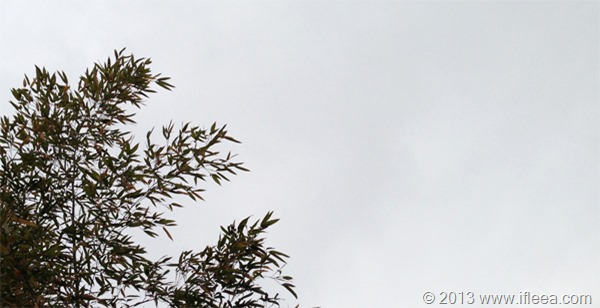

惰性啊惰性。人忙起来的时候盼望着迅速闲下来，而闲下来之后却又完全忘却了忙时安排的计划，像一滩烂泥一样无论好事坏事都提不起精神。 日子平平淡淡不知不觉竟然到了3月，看博客最新一篇日志已经是10月底的事情，竟然有4个多月没有静下来梳理一下忙乱的生活。

回头这几个月，忙忙碌碌也挺开心，不知不觉日子在每天一鼠标一鼠标的点击下就过去了。 过年的时候不免和长辈以及长辈的长辈交流，似乎他们对我现在这样的现状表现出一种因为不明白不理解而产生出的类似卧槽年轻人你牛逼的意思，也有长辈以及朋友的长辈对我的情况发出来卧槽年纪轻轻不工作没个大企业做靠山总有那么万一的一天发生那你这个年轻小子就不知道吃什么喝什么怎么办了这样的顾虑声。 同辈人自然是看得开，敢做，就好。 那最重要的，一方面家人对我表示支持，10月底的时候妈妈出资我购置工作电脑，在西安租住房屋就是对我的支持，那现在除非结婚买房这样的大事，也无需再向父母伸手，反而有时候还能补贴一点点家用。 但另一方面，能看得出父亲还是有一点顾虑，能找个地方锻炼锻炼也不失为良方。

所以，我困在这样的纠结当中。一方面觉得自己现在从事的自由职业又灵活又锻炼，从里到外一个人，定价接活儿制作交付售后一人搞定；而另一方面也正是觉得一个人没有圈子。 或者站在另外一个角度，按正常的轨迹似乎都是学习毕业工作结婚生子而子女继续学习毕业工作结婚生子，如果不遵循这样的康庄大道，自己会步入什么样的羊肠小道呢？ 说不清楚，这只能是和我伟大的关键词过滤一样摸着石头过河，只是水深水浅水热水冷河对岸是否有另一条羊肠小道风景如画就不得而知。 一切只有走到了才知道。

昨天下午在家喝茶上网过公务员生活的时候，又进入JF君的某网易博客，看了其大三大四阶段的近二十篇小博，大多是描写生活琐事以及大学时候对未来工作向往对爱情迷茫的情感，似乎存在在那样的不确定当中，眼中才能放出熠熠的光彩。 三年后看着当初的图样图森破，嘲笑当年自己也曾SB过的同时也唏嘘岁月从我们脑子带走了那时多样的思想，似乎现在正在一步一步走向当时觉得SB才会走的方向，而现在边走边回头看看当年sometime naive… 嗯，简单的说就是，人就是这样不满足现状。

目前的计划，我想继续这样走，being a freelancer，试看几年后，我是否会嘲笑现在的图样图森破。
