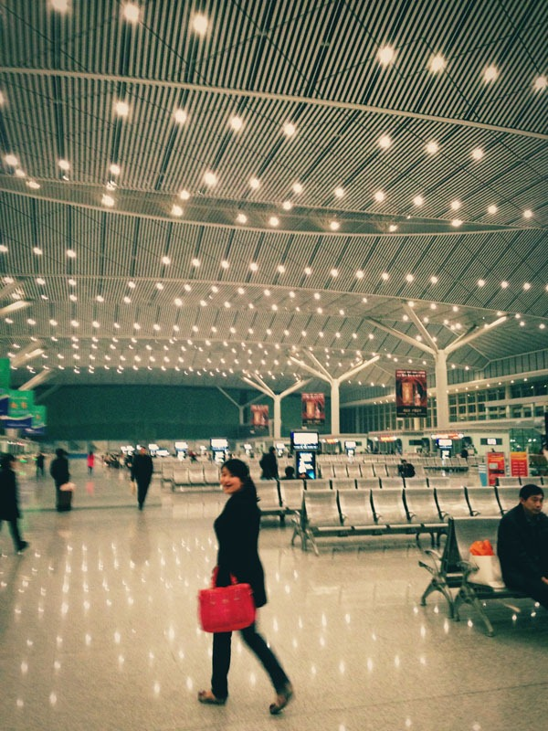
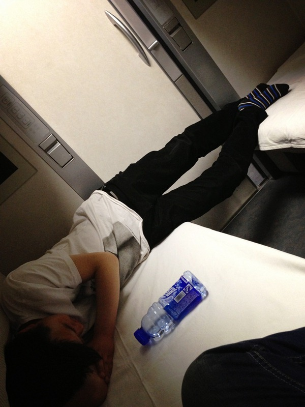
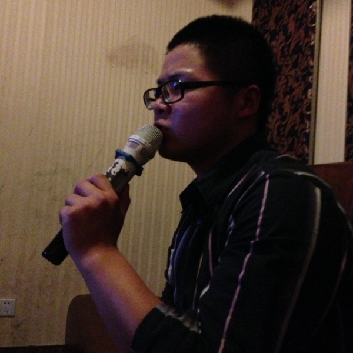
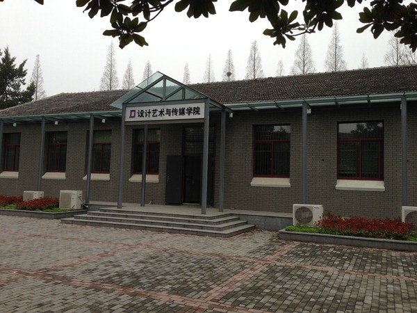
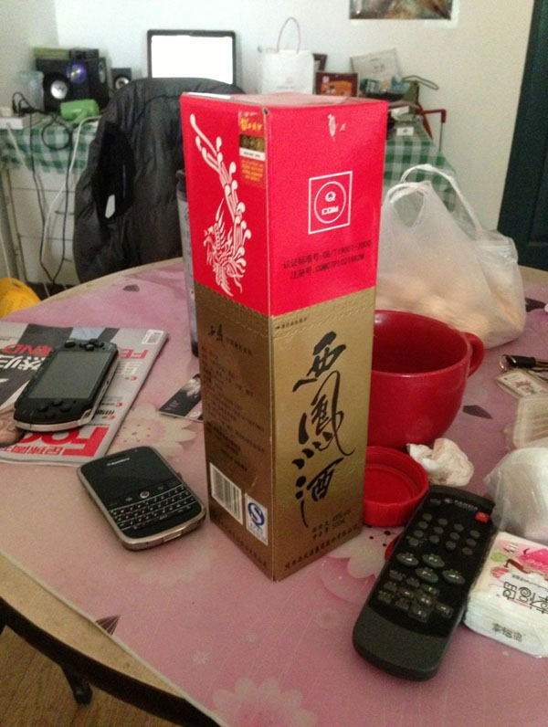
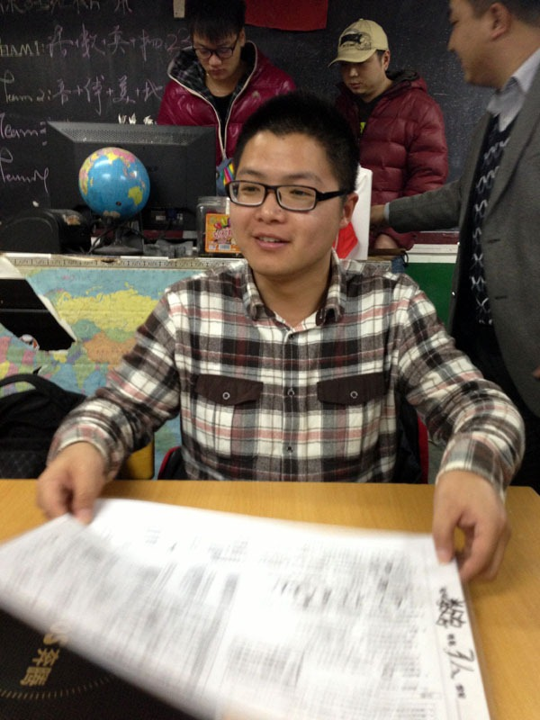

3月21日晚上的火车，8小时的动车直逼南京，不得不说毕业后铁路运输发展之快。原来15小时的路程现在8小时就到。火车始于西安北站，王小沫同学亲自送行，相比于西安老火车站的贫民窟脏乱差景象，北站简直如大观园般壮美，而且地铁与火车站的融合类似上海虹桥的方便程度也把西安站比了下去。

插曲：原本卧铺改硬座应该是让人振奋的好消息，但河南某阳光少年上车后，确切说是脱鞋后的变换却是翻天覆地，浓郁的脚臭味直接把我推出了卧铺仓，在过道坐到1点多实在撑不住之后勉强回来休息。 还是那句话，江湖险恶，要么忍，要么滚。

早上5点火车准时到达南京，出车厢的瞬间似乎感到每一丝空气都带着熟悉的气息，马不停蹄搭出租直奔飞哥的贫民窟，司机狂飙的路途上满眼都是回忆。那些年的青葱年少都在那片热土挥霍。5点半的贫民窟早餐摊位已经摆开了，吃了点饼子喝了些粥就随飞哥回到他的电梯洋房。

早上靠上等wisky配魔兽争霸渡过了哥的困发期，中午慷慨的飞哥哥请我和小龙去了一家日本SUSHI店，每人两扎冰啤的奔放SUSHI style打开了酒场的序幕。酒足饭饱又奔赴周围一家一流KTV。晚间和乔老师小龙领导等人继续把酒言欢。

欲听飞哥哥歌喉，请点此传送门：[http://papa.me/post/i8zN1BZ0](http://papa.me/post/i8zN1BZ0 "http://papa.me/post/i8zN1BZ0")

Day2 一早睡到晌午，回到南理工追忆当年的自己，看到现在的少年犹如当年的自己。下午与兄弟们踢球晚间与兄弟们把酒已成固定的项目。

Day3，由于D1 D2连续喝酒，D3早起已然身寒头痛，投箸提笔唯膀子疼，遂随飞哥前往附近菜市采购，以有机会赞颂飞哥之手艺，然期间看到关中之西凤赫然列于酒架，眼神相对之后免不了中午的又一次畅饮。

晚间随飞哥前往某80后主题餐厅。作为80最后的我来说，有些80后的记忆是模糊的，但有些却格外清晰。此为飞哥帅气交卷时的场景，班长校长在讲台上主持着大家的回忆，我在台下珍惜最后的几小时时光。

\--------------我是骚情的分割线-------------------------

2011至2013，当年稚气的我们早已褪去了少年的摸样，举手投足间似有似无的成熟仿佛远处高楼上渺茫的歌声似的，轻轻地推门进去，什么声息也没有，年少轻狂已熟睡的心好久了。年轻给了我们无尽的希望，更给了我们爱与责任。
