6月24日，西安天气阴郁但却清爽，正是骑行的好日子。但阴差阳错一般，我和高在24号决定25号再出发，风雨无阻。 于是便迎来了25号这万里无云的大好晴天（其实天气预报说是多云天），也有了这一次不同寻常的骑行。

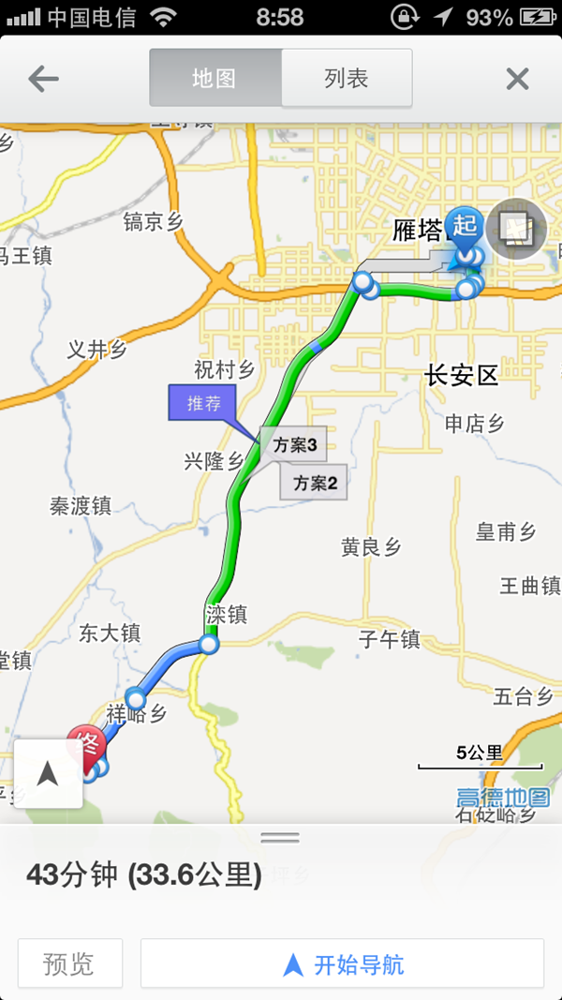

这是计划路线，一路沿着210国道骑到丰裕口的转盘，再换107国道向西直至东大/高冠。

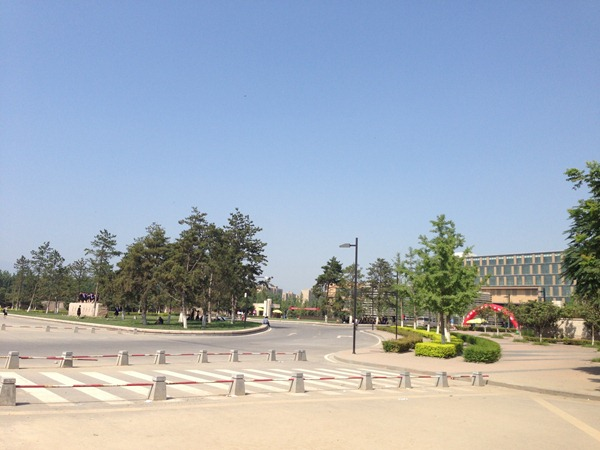

第一休息站，西安电子科技大学新校区，图左边石碑上是毕业拍照留念的学子们。 请问多云天气，云呢？ 云呢?

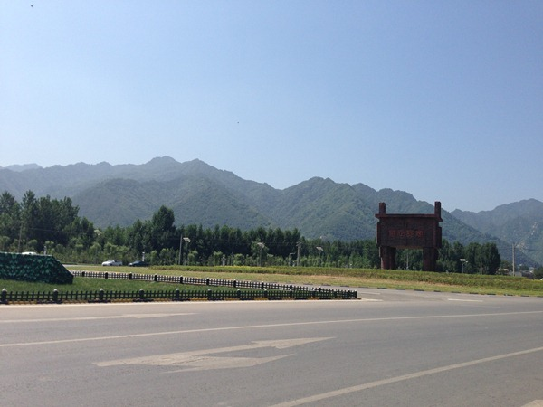

国道210与国道107交汇处转盘，意淫的大鼎刻着“盛世长安”，在巍巍秦岭的衬托下越发搞笑。 从次右转，一路向西。

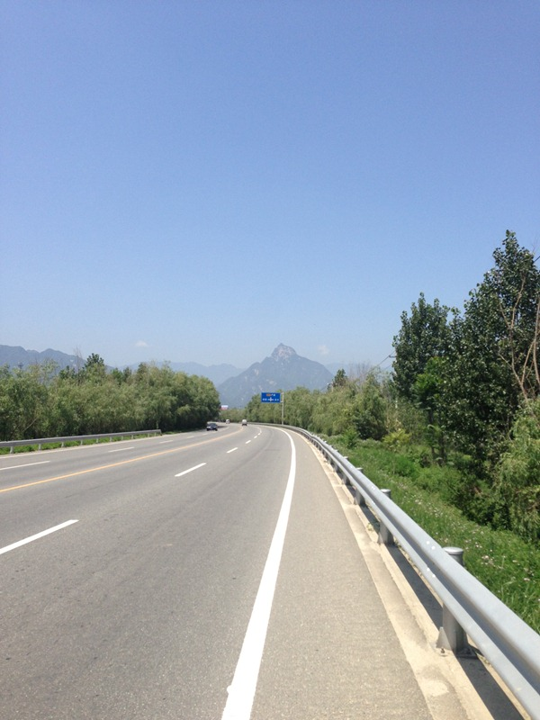

向西的路略微恐怖啊，这种隔离带给人一种高速路的感觉，限速80都挡不住过往司机加速的欲望，一辆辆车呼啸而过。 远处的那个小山包略有桂林的感觉啊。

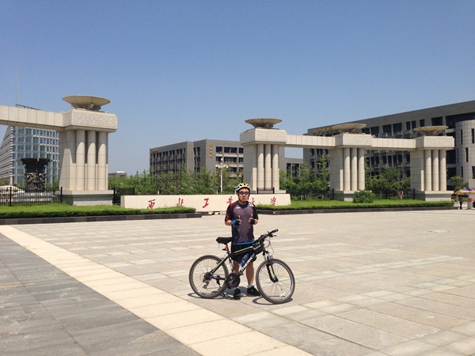

第二站，西北工业大学东大校区。 真泥煤的大啊，大到尿啊。

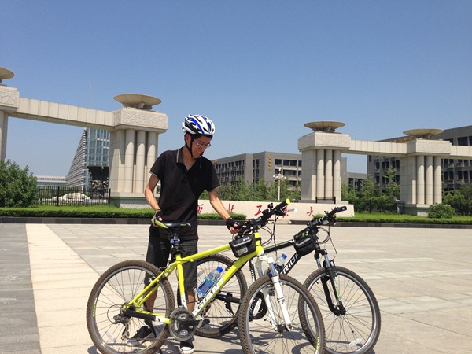

骑车的意义在于锻炼，迟早有一天，我会瘦成这样！

中午在东大镇东大村某菜馆和旧时同学小于一起把酒言欢，近10年的岁月把我变成了一个胖子，把小于变成了一个博士。

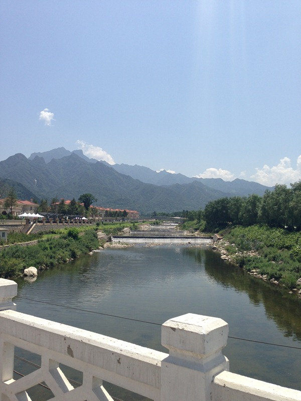

吃晚饭继续上路，中午1/2点的太阳果然不是吹牛逼的，不过这样的风景让人继续前行。

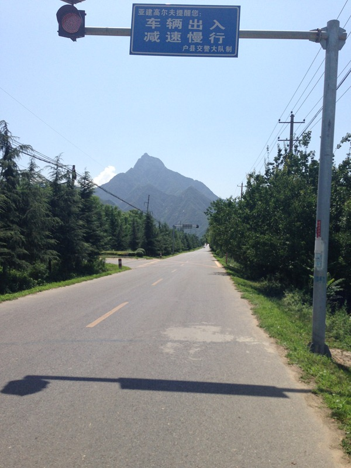

“亚建高尔夫提醒您：” 这已经到了户县境内了，小于博士提醒我，过了高尔夫，就能下河了。 加速前进！

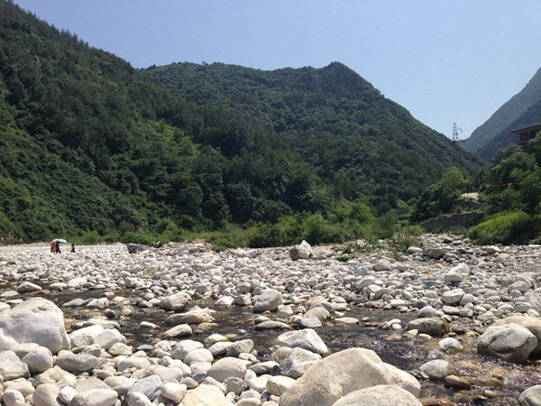

哈，果然啊果然，秦岭中流出的清澈的小河。

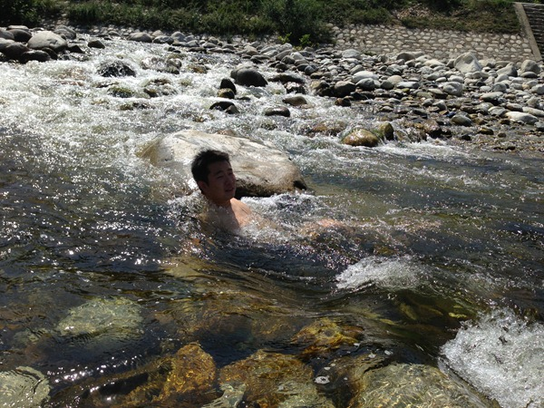

快让我在这高温中下河撒个野。

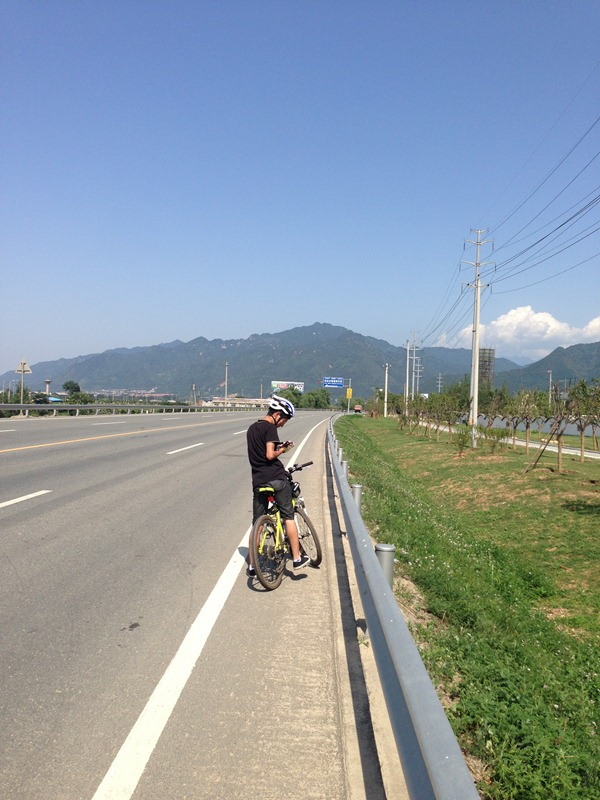

回去的路更晒了。 途中我们路过子午镇的时候，又一人吹了一瓶啤酒才继续上路。回到家时候小胳膊小腿儿已经晒得不成样子。

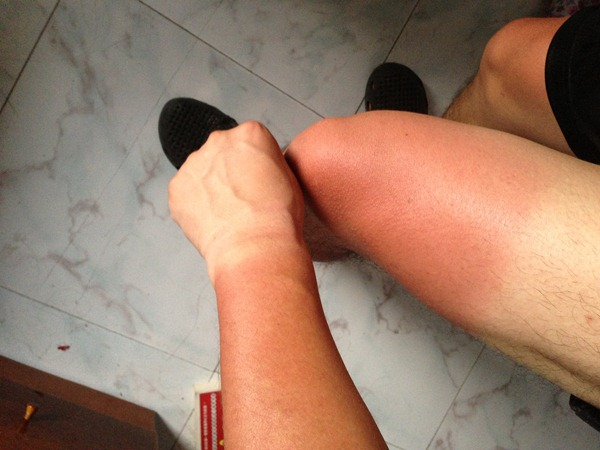

那天的红现在已经全部转为了黑，说多了都是泪啊。

\--------------------------------------------------

全天骑行约80km，从早到晚的路上消耗脉动x4，啤酒x3，可乐x1，满满8瓶子水换来了一天与烈日的搏斗。菜B骑手骑着买菜烂车，照样能玩儿的很哈皮。
