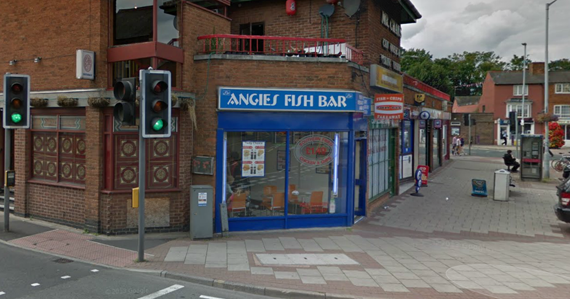

本文开始于20130702中午，但完成于20130727，中间由于犯懒，策划出游，出游等等原因直到今天（20130727）才将它完成。

其实是想写昨天的求职经历的，但是思来想去貌似2011年年底在UK的那次才算是真正意义上的人生第一次求职经历，那就先贴出那一次的再跟进昨天的吧。

图是从google map 的street view 上面扒下来的图，这就是我应聘的那个小店，一个巴基斯坦人开的fish bar，主营英国国菜fish & chips，还有别的burger 之类的快餐。这个地方也是我出门去学校的必经之路，就在我已经记不起的某天，我像往常一样路过，看到一个黄色的小纸上面写着“STUFF WANTED”，印象中留学生都是很苦逼的一边打工一边上学的路数，所以我也自己打印了一份非常简单的小简历给了老板，老板说好的，会打电话的，然后大家知道的，再也没有然后了。

现在在正式说说我在国内这第一次的求职经历。

求职目标是西安某院校的独立院校，我本着去代代课陪着学生打打闹闹的态度认真地想给自己谋一份差事，为此我还特意打印了两份个人作品集。7月的西安热的要命，我一大早穿戴整齐挎着小包就去了目标学校。

首先去人事科，对话我觉得挺好玩的。

> \-您好，我是来应聘工业设计教师的，这是我的材料和作品集。
> 
> \-您好，我先看看。
> 
> 3分钟后，经历了一些冠冕堂皇的人人都觉得无聊的讨论之后。
> 
> \-你期望的薪资是多少？
> 
> \-我觉得一个年轻人，重要的是学习的过程，薪资应该放在第二位，在西安够维持生活就行了。
> 
> \-那你觉得是多少呢？
> 
> \-3000出头就可以了吧（我小心翼翼的说）。
> 
> \-那估计还有一定的差距。
> 
> \-哦，那课余时间呢？
> 
> \-我们是需要你坐班的，周一周五，8点5点。
> 
> \-哦，呵呵呵呵呵~
> 
> \-喝哈哈哈~

然后人事科打电话叫来了工业设计系的老师，要安排我跟系里见一见。结果来的老师也是个年轻人，看起来和我年龄不相上下，跟我聊了聊关于学校的认识和工作的认识，也谈了谈学校关于人才培养的计划之类，其实都是学生过来的，我也清楚他手中那个所谓的培养计划真正执行到下面也就成了你们别打架别惹事男生别沉迷网吧女生别老去三分钟无痛的节奏。

聊毕他约我下午来个简单的试讲，我想了想那就讲Pro/E的曲面建模好了。中午在学校边上吃了个云南米线帅哥套餐之后就在图书馆大致准备了准备。可谁知道下午见面后却告知我某老师有事情下午没办法了。 本来就不想去这个月薪2K+的坐班工作，这样出尔反尔的态度也坚定了我的立场。

下午还见了见他们的院长，没有对人不敬的意思，但显然把工业设计专业放在人文学院是一个愚蠢的决定。院长一不懂设计，二不通英语，在设计方面可谓用一个极品外行的态度品评设计，在遇到英语方面就只能看看图，吹吹牛逼了。

晚上给接待我一天的老师去了短信，非常客气地表达了我的谢意和歉意，他没有回复我。 事情就这样结束了。

\---------------------------------------

回来之后我想，为什么这个职位要求硕士起但月薪却连3K都达不到？ 三本民办独立这一类的院校收学生高额的学费却不愿意给老师一个合理的待遇，但却又有大批的人希望能够进入这个职业，他们是图哥个毛呢？ 2K+月薪的稳定又有神马吸引人呢？ 但同窗何同学的一句话似乎点明了一点点端倪，他说凡是国企机关一类工作的人，不在乎工资待遇等问题，他们需要的是一个上升的通道，或明或暗。 我虽然不敢苟同，但也不得不承认这似乎是一种现状。

告别这个机会之后，我没有再去寻找新的机会。
