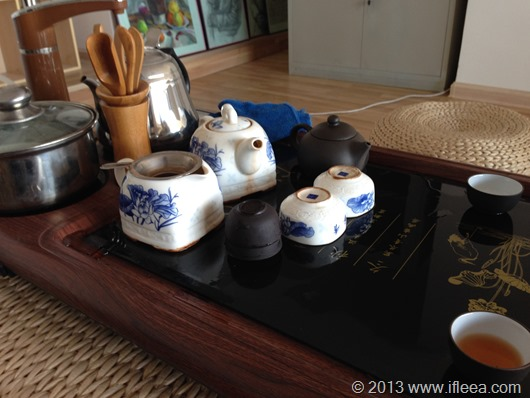

从学设计的时候开始，就关注着西安的工业设计产业，07/08/09那几年正是我本科的前两三年，那时候的工业设计还是个新鲜词汇，几乎没什么人知道这个词，包括填报志愿的我也完全不知道工业设计原来和机械设计差别千山万水，那时候西安的工业设计基本上可以说是一片空白。

在西安也算一年有余了，除了7月面试了一个3本学校然后又主动放弃，也没有正式的考虑过其他工作的岗位。 还是不能够放下设计本身，又不愿让自己的傍身技艺随着体制而逐渐剥落。12月7日拜访的是一位摸爬滚打在西安工业设计的前辈，以求职之名却受到了朋友的对待，一壶茶续了几次水，不知不觉一下午时间飞逝而过。

在他身上我看到一个前辈对于设计的执着和坚持，西安整体设计产业虽然较以前有了很大改善，但整体看仍然处于萌芽阶段，他们是默默推动西安设计发展的中坚力量。攀谈当中看得出这几年他坚持的不易，也看到西安设计逐渐冒出的一点点曙光。
